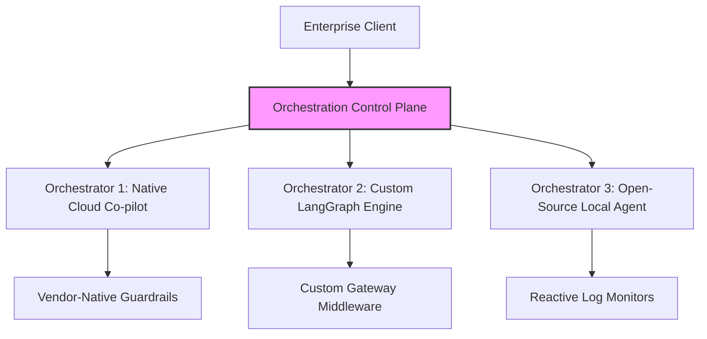

# **The Runaway Agent Crisis: Inside the Enterprise Governance Gap, Three-Orchestrator Sprawl, and the Context Gap Paradox**

##

### The Silent Bleeding of the Enterprise Agentic Fleet
Two days ago, on August 20, 2026, VentureBeat published its latest **VB Pulse** survey, sending a shudder through enterprise platform engineering teams. The headline finding is a stark warning of the financial and security risks latent in current AI infrastructure: approximately **20% (one in five) of enterprises lack the ability to stop a runaway AI agent’s spending in real time**. 

In the rush to deploy autonomous agents, organizations have granted LLMs direct access to write code, call paid external APIs, and provision cloud resources. Because these agents operate on autonomous, multi-step loops, a single reasoning bug or tool-calling failure can trigger an infinite execution loop. Unlike traditional software, which fails predictably and crashes with a clear stack trace, an autonomous agent caught in an unmonitored loop will continue "vibe coding" its way through thousands of dollars in tokens before human administrators even realize there is an anomaly.

This operational reality has prompted infrastructure veterans to sound the alarm. Kelsey Hightower, writing on Bluesky, warned platform engineers that they must **"treat AI agents like malware."** Hightower argues that from a platform engineering perspective, autonomous agents represent a security and financial nightmare: they are non-deterministic, generate runtime code that bypasses traditional CI/CD pipelines, and burn expensive tokens to solve problems that traditional, deterministic code could execute at zero marginal cost. 

---

### The Fragmentation Crisis: Why the Median Enterprise Runs Three Orchestrators
To mitigate the risks of vendor lock-in and address a profound lack of trust in any single vendor's safety controls, the median enterprise has adopted a highly fragmented approach, simultaneously operating **three distinct orchestration platforms**. 



This multi-orchestrator sprawl is a defense mechanism. IT leaders do not trust vendor-native guardrails to protect their cloud infrastructure or prevent runaway token bills. Harrison Chase, co-founder and CEO of LangChain, has noted that the industry is shifting away from early, unconstrained "open-loop" agent frameworks (like the early AutoGPT prototypes) toward **"bespoke cognitive architectures"**—directed, graph-based execution structures like LangGraph. These architectures encode strict state boundaries and require explicit planning harnesses to keep agents from drifting. Yet, because vendors do not offer unified governance standards across platforms, enterprises are forced to maintain parallel stacks, increasing operational complexity and security surface area.

---

### Architectural Strategies: How Enterprises Fight Runaway Agents
The architectural strategies currently deployed to prevent runaway spending reflect a deeply divided market. According to the VB Pulse survey, enterprise mitigation tactics are split across four distinct methodologies:

```
[30%] Native Platform Budget Caps & Throttling
[25%] Custom Gateway Middleware
[25%] Dynamic Routing (Model Degradation)
[21%] Reactive Post-Hoc Log Monitoring
```

1. **Native Platform Budget Caps and Throttling (30%)**: These organizations rely on hard limits set at the provider level (e.g., OpenAI or Anthropic billing limits). While simple to configure, this approach is a blunt instrument. When a budget cap is breached, the entire agent fleet freezes, causing disruptive production outages.
2. **Custom Gateway Middleware (25%)**: Enterprises are increasingly inserting a proxy gateway between the agent orchestrator and the LLM APIs. This middleware intercepts every request, validates JSON schemas, runs security audits, and statefully tracks cumulative token spend per task.
3. **Dynamic Routing (25%)**: A highly technical strategy where the gateway middleware monitors the cost of a running task context. If the task spend exceeds a predefined warning threshold, the gateway dynamically routes subsequent prompts from premier models (e.g., `claude-3-5-sonnet`) to lower-cost models (e.g., `claude-3-5-haiku` or `gpt-4o-mini`), degrading reasoning capabilities gracefully to save budget.
4. **Reactive Post-Hoc Log Monitoring (21%)**: These organizations remain highly vulnerable. They do not possess runtime controls, relying instead on log ingestion pipelines (e.g., Datadog or Splunk) to alert them *after* a runaway loop has already incurred massive charges.

To demonstrate the implementation of custom gateway middleware and dynamic routing, we have developed a reference implementation of a stateful budget interceptor and circuit breaker in the project files [`circuit_breaker.py`](file:///Users/vzl/.gemini/antigravity-cli/brain/9796401e-90ab-48ea-8000-bf3810133812/scratch/agent_governance/circuit_breaker.py) and [`gateway_middleware.py`](file:///Users/vzl/.gemini/antigravity-cli/brain/9796401e-90ab-48ea-8000-bf3810133812/scratch/agent_governance/gateway_middleware.py).

The core logic of the circuit breaker state machine, implemented in the [`AgentCircuitBreaker`](file:///Users/vzl/.gemini/antigravity-cli/brain/9796401e-90ab-48ea-8000-bf3810133812/scratch/agent_governance/circuit_breaker.py#L8) class, detects runaway repetition loops by hashing tool calls and comparing consecutive signatures:

```python
# From /scratch/agent_governance/circuit_breaker.py
if tool_name:
    action_signature = f"{tool_name}:{str(sorted(tool_args.items()) if tool_args else '')}"
    self.tool_call_history.append(action_signature)
    
    # Check for repeating consecutive signatures (infinite loops)
    recent_calls = self.tool_call_history[-self.repetition_threshold:]
    if len(recent_calls) == self.repetition_threshold and len(set(recent_calls)) == 1:
        raise RunawayAgentException(
            f"Infinite loop detected! Agent called tool '{tool_name}' "
            f"with identical arguments {self.repetition_threshold} times consecutively."
        )
```

The gateway proxy [`AgentGatewayMiddleware`](file:///Users/vzl/.gemini/antigravity-cli/brain/9796401e-90ab-48ea-8000-bf3810133812/scratch/agent_governance/gateway_middleware.py#L13) intercepts the agent's LLM calls, estimates execution costs, and dynamically downgrades the model if spend utilization exceeds a safety threshold:

```python
# From /scratch/agent_governance/gateway_middleware.py
if utilization_pct >= self.warning_threshold_pct:
    fallback_model = self.fallback_map.get(original_model)
    if fallback_model:
        model_to_use = fallback_model
        print(f"[GATEWAY WARNING] Spend utilization at {utilization_pct:.1f}%. "
              f"Dynamically routing from '{original_model}' to '{fallback_model}'.")
```

---

### The "Context Gap" Paradox: When More Context Means More Failures
Perhaps the most counterintuitive finding in the August 2026 VB Pulse report is the **"Context Gap" Paradox**: enterprises that deployed governed context layers reported agent failures at **more than double the rate** of those operating without one. 

While context layers are engineered to feed agents rich metadata, schema definitions, and business logic, their deployment exposes three major architectural vulnerabilities:

1. **Observability vs. Causality (The Instrumentation Bias)**: The primary reason for this statistical divergence is visibility. A governed context layer acts as an audit trail. Organizations without a context layer suffer from *silent failures*—agents return confidently wrong answers or write buggy code, but because there is no instrumentation, these errors are never logged or measured. When an enterprise deploys a context layer, it finally instruments the agent fleet, bringing these latent failures to light.
2. **Context Rot and Attention Dilution ("Lost in the Middle")**: To provide agents with "complete" business context, systems flood the LLM prompt with extensive database schemas, historical interaction logs, and policy documents. However, as the context window fills with noisy, semi-structured metadata, the model’s reasoning capacity degrades due to attention dilution. Research indicates that when context windows are overloaded, models struggle to locate key information placed in the middle of the prompt.
3. **Compound Error Rates and Context Drift**: In long-running agentic loops, every reasoning step degrades overall task accuracy—empirically measured at a ~2% degradation per step. If an agent loops repeatedly and feeds its historical execution history back into its context window, it experiences "context drift." The model begins over-indexing on its own past errors and outdated tool outputs, accelerating the drift toward an incorrect final outcome.

---

### The Transition: From Token-Based Utilities to Outcome-Based Unit Economics
As enterprises confront the unpredictability of runaway agent spending, the financial model of AI is undergoing a fundamental shift. Token-based pricing ($ per million tokens) treats LLMs as a utility, shifting all execution and loop risk onto the buyer. If an agent spins in a circle and consumes 20 million tokens, the enterprise is billed for the compute regardless of the outcome.

To build predictable budgets, enterprise CFOs are demanding a transition to **outcome-based metrics**. In this model, pricing is tied directly to the completion of a defined task—such as a resolved support ticket, a successfully provisioned and verified cloud server, or a merged pull request. 

Notable venture capitalist Sarah Guo, co-host of the *No Priors* podcast, has written extensively about the rise of **"Dark Code"**—autonomous agent production behaviors that emerge dynamically and cannot be explained or verified by traditional static analysis. Guo emphasizes that because autonomous agents produce "Dark Code" and execute non-deterministic paths, traditional software seat pricing is obsolete. Instead, software economics must shift toward selling "units of cognition." VCs like Elad Gil agree, noting that the enterprise is transitioning from paying for software tools to paying for digital labor, where the vendor assumes the risk of computational efficiency.

---

### The Future of Agentic Governance: Active Guardrails and Runtime Sandboxes
The era of reactive post-hoc monitoring is coming to an end. Managing autonomous physical and digital agents requires moving away from static dashboards and toward runtime sandboxing.

Emerging governance tools are enforcing real-time guardrails directly on execution environments. This includes:
* **Agent Authority Contracts**: Declarative configurations defining exactly what tools and resources an agent identity is authorized to access, enforced at the API gateway layer.
* **Durable State Sandboxes**: Running agents inside isolated containers where execution state can be paused, inspected, and rolled back by human operators when anomaly detection flags a loop.
* **Stateful Circuit Breakers**: Standardizing interceptors like the [`AgentCircuitBreaker`](file:///Users/vzl/.gemini/antigravity-cli/brain/9796401e-90ab-48ea-8000-bf3810133812/scratch/agent_governance/circuit_breaker.py#L8) to enforce hard step limits and repetition detection directly at the SDK level.

As Kelsey Hightower succinctly noted, until we can securely govern the execution pathways of autonomous software, we are simply writing expensive scripts that spend money faster than we can audit them.

***

# 4. Highlight

## 4.1 Key Questions
* How can platform teams detect and intercept runaway AI agent reasoning loops in real time?
* Why does the implementation of governed context layers correlate with a 2x increase in reported agent failures?
* What architectural mechanisms are required to transition from speculative token-based billing to outcome-based contract economics?

## 4.2 Highlight Text
The latest VB Pulse survey reveals a critical enterprise governance gap: 1 in 5 enterprises cannot halt a runaway AI agent's spend in real time. As agents transition from simple chat interfaces to autonomous actors provisioning cloud resources and calling paid APIs, unmonitored loops are silently bleeding budgets. The median enterprise now operates 3 orchestration engines simultaneously due to a total lack of trust in single-vendor guardrails. Meanwhile, governed context layers have doubled reported failure rates—unmasking silent failures while triggering severe context drift. The future belongs to runtime gateways and active circuit breakers.

## 4.3 Hashtags
#AIGovernance #LLMOps #PlatformEngineering #AgenticAI #FinOps
