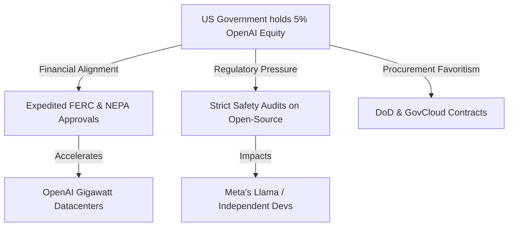

# **The Sovereign Model: Inside Sam Altman’s $42.6 Billion Proposal to Hand the U.S. Government a 5% Stake in OpenAI**

####

As OpenAI prepares its corporate restructuring to transition from a capped-profit entity to a traditional for-profit C-corporation, CEO Sam Altman has quietly proposed a geopolitical masterstroke: giving the United States government a 5% equity stake in the company. 

At OpenAI's current private valuation of $852 billion—solidified on March 31, 2026, following the close of its historic $122 billion funding round anchored by Amazon, NVIDIA, SoftBank, and Microsoft—this 5% slice represents a staggering $42.6 billion transfer of equity. In conceptual discussions pitched directly to President Donald Trump, Commerce Secretary Howard Lutnick, and Treasury Secretary Scott Bessent, Altman has framed this proposal as a mechanism to distribute "AI dividends" to the American public, explicitly modeling the structure after the Alaska Permanent Fund.

Yet, behind the egalitarian rhetoric of public wealth distribution lies a highly calculated strategy to secure regulatory immunity, fast-track unprecedented energy infrastructure, and establish OpenAI as the de facto "National Champion" of the American AI apparatus. As OpenAI targets a $1 trillion public market debut, this potential integration of state power and private AI laboratory raises deep technical, operational, and competitive conflicts.

#### The Financial Engineering: "AI Dividends" vs. The Cash Flow Reality

The comparison to the Alaska Permanent Fund—or Norway’s Government Pension Fund Global—reveals a fundamental mismatch in corporate finance. The Alaska Permanent Fund is funded by liquid, cash-generating mineral royalties from the extraction of crude oil. It operates on real-world commodity yields that are distributed as cash.

In contrast, OpenAI is a hyper-growth, compute-bound startup with a massive capital expenditure (CapEx) burn rate. The company’s $122 billion cash infusion in March 2026 is destined to buy NVIDIA GPUs, lease specialized optical networking hardware, and secure gigawatts of electricity. A 5% equity stake in a non-dividend-paying C-corporation does not generate cash dividends. 

```
+-----------------------------------------------------------------------+
|                       THE ALASKA VS. AI FUND MOATS                    |
+-----------------------------------------------------------------------+
|  Alaska Permanent Fund Model       |  Proposed AI Sovereign Fund      |
|  ---------------------------       |  ---------------------------      |
|  • Funded by liquid oil royalties  |  • Holds illiquid startup equity |
|  • Generates predictable FCF       |  • High CapEx, zero dividends    |
|  • Independent of asset operation  |  • Creates regulatory conflict    |
+-----------------------------------------------------------------------+
```

For the federal government to yield payouts for citizens, it would rely on liquidity events:
1. **Secondary Market Sales:** Selling shares back to private buyers, which could depress OpenAI's private share price.
2. **Share Buyback Programs:** Forcing OpenAI to divert cash flow away from training frontier models to repurchase government-held stock—a move that would actively handicap OpenAI in its technology race against Google and Meta.
3. **An Initial Public Offering (IPO):** Relying on a public market float at a $1 trillion valuation where the government gradually liquidates its position.

Furthermore, Altman's proposal extends an invitation for competitors like Google, Meta, and Anthropic to contribute a matching 5% of their equity to the fund. This has sparked intense skepticism. Critics on Reddit's r/MachineLearning have pointed out the disparity: *"Taxation is the legal, standard way to capture corporate upside. Handing over direct equity is effectively a corporate tribute in exchange for regulatory capture."*

#### The Infrastructure Trade: Gigawatts for Equity

Altman’s primary bottleneck is no longer capital; it is physical compute infrastructure. The training runs for next-generation frontier models require gigawatt-scale data centers. Altman has actively lobbied the White House for federal support to construct 5-gigawatt (GW) data center clusters—the equivalent power output of five nuclear reactors.

Building at this scale is currently paralyzed by grid capacity, the Federal Energy Regulatory Commission (FERC) queues, and years of environmental reviews under the National Environmental Policy Act (NEPA). By offering the U.S. government a $42.6 billion stake in its success, OpenAI aligns the state's financial self-interest with its operational expansion:
* **Grid Fast-Tracking:** The Department of Energy (DOE) and FERC would face immense political pressure to prioritize grid connections for OpenAI facilities.
* **Environmental Waivers:** Executive orders could expedite NEPA reviews under the guise of "national security priority."
* **Nuclear Integration:** Direct access to decommissioned or federally subsidized nuclear plants could be routed straight to OpenAI’s clusters.

For the Trump administration, Howard Lutnick, and Scott Bessent, the proposition offers a tangible national security asset. Under this framework, OpenAI’s model weights (from the GPT-5/Strawberry/Orion architecture lineages) would be treated as critical national infrastructure. The technical implications point to the creation of a "sovereign compute cloud"—isolated, federally run clusters hosted on GovCloud with security clearances required for core researchers and systems engineers.

#### The Competitor Backlash and the Open-Source Threat

If the U.S. government holds a 5% stake in OpenAI, it introduces a profound conflict of interest into the regulatory landscape. The Federal Trade Commission (FTC), Department of Justice (DOJ), and SEC would be policing a market where the state has a multi-billion-dollar incentive to favor one player.

Competitors have reacted with alarm. While Anthropic has reportedly refused to participate in these discussions, Google and Meta view the proposal as a move to construct an insurmountable regulatory moat. VCs like Marc Andreessen have long warned against the creation of "red-tape monsters" that stifle innovation. On X.com, discussions among tech founders highlighted this threat: 

> *"If the government is a shareholder in OpenAI, every open-source release from Meta or independent developers will be framed as a threat to national security—or worse, a threat to the public dividend fund. It creates a state-sponsored monopoly."*

Meta’s Chief AI Scientist, Yann LeCun, has consistently argued that proprietary capture of AI by a few closed-source companies is a systemic threat to digital sovereignty. If the state backs OpenAI, the regulatory hurdles for open-source alternatives (like Llama) could be artificially inflated to protect the value of the government’s 5% asset.



#### The Constitutional and Operational Quagmire

Executing an equity transfer of this nature is a legal minefield. Under the Anti-Deficiency Act and standard federal procurement statutes, the Executive Branch does not have the unilateral authority to accept or hold equity in private corporations. Doing so would require explicit Congressional authorization.

Historically, the U.S. government has taken equity stakes in private firms only under dire emergency conditions:
* **The 2008 Financial Crisis (TARP):** The Treasury acquired warrants and preferred stock in financial institutions and auto manufacturers (GM, Chrysler) to prevent systemic collapse, with a strict mandate to liquidate as soon as stable.
* **The 1970s Rail Crisis:** The creation of Amtrak and Conrail.

Applying this to a highly profitable, speculative AI lab in the absence of a financial crisis is unprecedented. It also stands in sharp contrast to legislative alternatives, such as Senator Bernie Sanders' *American AI Sovereign Wealth Fund Act*. Sanders' bill proposes a 50% public ownership stake financed by a massive one-time stock tax on AI giants—a structure that Silicon Valley VCs warn would trigger a capital flight to off-shore jurisdictions.

Altman's 5% proposal is a defensive compromise: a voluntary equity grant designed to preempt aggressive taxation and regulatory fragmentation, while cementing OpenAI as America's sovereign AI laboratory.

---

### 4. Highlight

#### 4.1 Key Questions
1. How can a non-dividend-paying, high-burn AI company yield payouts for a public "AI Dividend" fund without compromising its R&D budget?
2. What are the antitrust and regulatory implications for open-source AI if the U.S. government acquires a $42.6 billion financial stake in a proprietary lab?
3. Can the Executive Branch bypass standard procurement and constitutional hurdles to hold private startup equity without Congressional authorization?

#### 4.2 Highlight Text
OpenAI CEO Sam Altman’s conceptual proposal to hand the U.S. government a 5% equity stake—worth $42.6B at its current $852B valuation—is a tectonic shift in tech policy. Under the guise of an "Alaska Permanent Fund" style dividend for citizens, the pitch aligns the state’s financial self-interest with OpenAI’s massive compute needs. From fast-tracked FERC/NEPA energy approvals to sovereign GovCloud integrations, this public-private alignment threatens to shut out competitors like Meta and Google, creating a state-sanctioned AI monopoly. However, without Congressional authorization, holding private equity remains a constitutional minefield.

#### 4.3 Hashtags
#OpenAI #SovereignWealthFund #AIPolicy #TechRegulation #SamAltman
