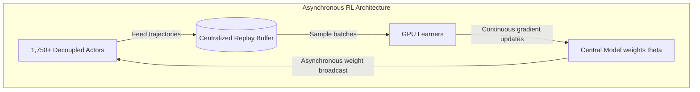

# The Sovereign Weights of Law: Harvey’s Tenet and the Post-API Shift in Enterprise GenAI

##

> [!NOTE]
> The final article has been archived on the system filesystem at [/Users/vzl/.gemini/antigravity-cli/brain/c25e963a-1049-472f-9bb9-87c2f95dc28f/blog_deep_dive.md](file:///Users/vzl/.gemini/antigravity-cli/brain/c25e963a-1049-472f-9bb9-87c2f95dc28f/blog_deep_dive.md) for long-term reference.

The enterprise Generative AI market is undergoing a silent but violent restructuring. The initial wave of vertical AI startups—often derided as "API wrappers"—is hit with a stark reality: renting intelligence from OpenAI, Anthropic, or Google is an unsustainable strategy for long-horizon agentic workflows. 

On August 20, 2026, legal tech giant Harvey drew a line in the sand with the announcement of **Tenet**, its first proprietary, domain-specialized large language model (LLM). Developed in collaboration with **Fireworks AI** and post-trained on Moonshot AI’s massive 2.8-trillion-parameter open-weight foundation model, **Kimi K3**, Tenet represents the arrival of "weight sovereignty" in enterprise AI. 

To evaluate this new class of autonomous legal systems, Harvey also open-sourced the **Legal Agent Benchmark (LAB)** (available on GitHub at `harveyai/harvey-labs`), a framework containing over 1,200 multi-step transactional tasks that moves past simple single-turn Q&A in favor of strict "all-pass" rubric checking.

This deep dive deconstructs the engineering, strategic, and economic rationale behind Tenet, Kimi K3, and LAB.

---

### 1. The Strategic Imperative: Why Startups Must Flee the API Wrapper Trap

For a legal tech startup, relying on frontier APIs (like GPT-4o or Claude 3.5 Sonnet) introduces three critical risks:

#### A. The Margins Squeeze of Long-Horizon Trajectories
Legal workflows—such as M&A due diligence, litigation sweeps, and contract drafting—are incredibly token-dense. An agent parsing dozens of contract PDF files, querying external case law databases, and repeatedly writing/refining clauses consumes millions of tokens per task run. At standard pay-as-you-go API pricing, a single comprehensive document analysis run can cost upwards of $20 to $50. By running a customized open-weight model on private, fixed-cost GPU infrastructure via platforms like Fireworks AI, startups can shift from volatile variable costs to stable, amortized operational expenses.

#### B. The Risk of Disintermediation
Foundation model providers are aggressively expanding into enterprise applications. OpenAI has its own corporate offerings, and Anthropic is moving up the stack. If a startup's core value proposition resides solely in prompt engineering, it is vulnerable to getting bypassed when the API provider updates their models or launches a competitive vertical tool.

#### C. "Sovereignty of Weights" and the Trust Boundary
In highly regulated sectors, the location and control of model parameters (the weights) is a security threshold. Law firms operate under strict rules of attorney-client privilege.
* **Model Drift:** Closed API providers update models under the hood. A silent update can break complex prompting structures and agent routing logic overnight. Owning the weights means freeze-framing the model checkpoint.
* **Auditability:** Law firms must be able to audit the security of the model. Possessing the weights allows firms to host the model inside a private VPC (Virtual Private Cloud) or on-premise, ensuring that sensitive litigation or transactional data never crosses an external boundary.

As Hugging Face CEO **Clement Delangue** noted on X:
> *"Sovereignty of weights is the number one concern for enterprise CIOs in highly regulated sectors. Open-weight models are the only path to true compliance."*

Harvey's co-founder and CEO **Winston Weinberg** echoed this sentiment:
> *"For enterprise vertical AI, relying on third-party APIs is like building on sand. If you don't own the weights, you don't own the product."*

---

### 2. Technical Foundation: Moonshot AI's Kimi K3 Architecture

To build Tenet, Harvey bypassed the standard choice of Meta's Llama models, opting instead for **Kimi K3**, Moonshot AI's flagship open-weights model released in July 2026. 

Kimi K3 is an autoregressive Mixture-of-Experts (MoE) transformer featuring **2.8 trillion total parameters**, with **16 out of 896 experts** active per token—resulting in roughly **50 billion active parameters** per forward pass. Kimi K3 provides a native **1,000,000-token context window**, which is essential for digesting multi-hundred-page contract suites.

Three core architectural innovations make Kimi K3 a robust foundation for domain-specific post-training:

#### A. Kimi Delta Attention (KDA)
Standard self-attention scales quadratically ($O(N^2)$) with sequence length, making a 1M-token context window computationally prohibitive. KDA replaces standard attention in a subset of layers with a hybrid linear attention mechanism. This maintains global sequence representation while reducing memory footprint and throughput overhead to linear scaling ($O(N)$) for extremely long sequences.

#### B. Attention Residuals (AttnRes)
In deep architectures (Kimi K3 utilizes 93 layers), signals can degrade when traversing standard residual pathways. AttnRes introduces skip-layer routing, allowing attention maps from arbitrary early layers to bypass intermediate representations and feed directly into deeper layers. This preserves high-fidelity semantic representations across long contexts.

#### C. Stable LatentMoE with Quantile Balancing
Routing tokens across 896 experts often leads to load imbalance and expert starvation. Kimi K3 utilizes **Stable LatentMoE**, routing tokens based on low-dimensional latent space representations rather than high-dimensional token features. It applies a quantile loss function to balance expert activation, ensuring that representation capacity is fully utilized during legal domain-specific alignment.

Furthermore, Kimi K3 is native-precision optimized using **MXFP4** (4-bit Microscaling Format) for weights and **MXFP8** for activations. This reduces memory footprint by 75% compared to FP16, allowing a 2.8T parameter model to run on standard H100 clusters without exhausting VRAM.

---

### 3. Training Mechanics: Asynchronous Reinforcement Learning with Fireworks AI

Harvey collaborated with **Fireworks AI** to post-train Kimi K3 into the legal-focused Tenet checkpoint. Rather than relying on simple Supervised Fine-Tuning (SFT)—which fails to teach models how to plan and correct errors—they utilized **Asynchronous Reinforcement Learning (RL)**.

#### Synchronous vs. Asynchronous RL Pipelines
In traditional RL setups (such as standard PPO), the pipeline is synchronous: actors generate trajectories (rollouts), write them to a buffer, and wait for the learner to perform gradient updates before receiving new weights.

In long-horizon legal tasks (e.g., executing a tool to search SEC filings, parsing PDF contracts, drafting clauses), trajectories are exceptionally long and execute with high latency. Synchronous RL would result in massive GPU starvation as the learner idle-waits for actors to finish their long rollouts.



To solve this, Harvey and Fireworks AI decoupled the pipeline:
1. **Decoupled Actors:** Approximately 1,750 actors continuously ran rollout environments using older model checkpoints, generating over 10,000 trajectories per epoch.
2. **Centralized Replay Buffer:** Trajectories were fed into a centralized buffer.
3. **Continuous Learner Updates:** The learner GPUs continuously sampled from the buffer, performing gradient updates on the active parameters. Off-policy corrections (such as V-trace) were applied to correct for the policy divergence between the actor checkpoint and the learner weights.

#### Reward Function Design and Data Integrity
To protect client confidentiality, **zero customer data was used** during post-training. Instead, Harvey combined public filings, synthetic legal scenarios, and expert-annotated legal rubrics (produced in partnership with Snorkel and Mercor). 

The reward model penalized:
* **Factual Hallucinations:** Inability to cite a specific page/clause in the uploaded corpus.
* **Unauthorized Practice of Law (UPL) Violations:** Generating definitive, binding legal advice without prompting for human attorney review.
* **Logical Inconsistencies:** Drafting a clause that contradicts another clause within the same agreement.

---

### 4. Evaluating the Long Horizon: The Legal Agent Benchmark (LAB)

Traditional benchmarks (such as MMLU-Law or LegalBench) measure single-turn question-answering or memorization. They fail to test whether an AI can act as an autonomous agent.

The **Legal Agent Benchmark (LAB)** (open-sourced at `harveyai/harvey-labs`) shifts the focus to agentic workflows. It contains over 1,200 complex tasks across 24 legal practice areas, backed by 75,000+ atomic rubric criteria.

#### The All-Pass Standard
A core innovation of LAB is the strict "all-pass" grading rubric. If an agent performs a redline on an NDA but misses a single liability-shifting clause, the entire task is graded as a **FAIL**. 

The evaluation framework uses an "LLM-as-a-judge" approach. You can inspect the core evaluation class [`RubricEvaluator`](file:///Users/vzl/.gemini/antigravity-cli/brain/c25e963a-1049-472f-9bb9-87c2f95dc28f/scratch/harvey_deep_dive/harvey-labs/eval/evaluator.py#L8-L67) in the benchmark codebase. 

The entry point of this evaluation runs in [`RubricEvaluator.evaluate_task`](file:///Users/vzl/.gemini/antigravity-cli/brain/c25e963a-1049-472f-9bb9-87c2f95dc28f/scratch/harvey_deep_dive/harvey-labs/eval/evaluator.py#L48-L67), which iterates through the criteria defined in [`rubrics.json`](file:///Users/vzl/.gemini/antigravity-cli/brain/c25e963a-1049-472f-9bb9-87c2f95dc28f/scratch/harvey_deep_dive/harvey-labs/eval/rubrics.json):

```python
    def evaluate_task(self, agent_output: str, rubric_filepath: str) -> Dict[str, Any]:
        rubrics = self.parse_rubrics(rubric_filepath)
        results = []
        all_passed = True
        
        for rubric in rubrics:
            passed = self.evaluate_criterion(agent_output, rubric)
            results.append({
                "rubric_id": rubric["id"],
                "passed": passed
            })
            if not passed:
                all_passed = False

        return {
            "task_passed": all_passed,
            "detailed_results": results,
            "pass_rate": sum(1 for r in results if r["passed"]) / len(results) if rubrics else 0.0
        }
```

Harvey reported that on the LAB: Contracts subset, Tenet achieved an **82% improvement in all-pass rate** compared to the base Kimi K3 model, demonstrating the effectiveness of asynchronous reinforcement learning on domain-specific trajectories.

---

### 5. Mixture-of-Experts: Cost-Benefit Analysis

Deploying a 2.8T parameter model like Kimi K3 presents a stark trade-off:

| Metric | Mixture-of-Experts (MoE) | Dense Architecture |
| :--- | :--- | :--- |
| **Total Parameter Capacity** | 2.8 Trillion (High representation) | ~70 Billion (Low representation) |
| **Active Parameters / Token** | ~50 Billion (Low FLOPs) | 70 Billion (High FLOPs) |
| **Memory Footprint (VRAM)** | High (Requires fitting 2.8T parameters) | Low (Fits on single node) |
| **Inference Cost** | Low (Compute cost of 50B parameters) | High (Compute scales with capacity) |
| **Routing Overhead** | High (Token routing to 896 experts) | None |

To serve Tenet economically, Fireworks AI deployed custom tensor-parallel kernels and low-precision quantizations (**MXFP4/MXFP8**). This minimized the node-to-node communication overhead caused by routing 16 tokens out of 896 experts, keeping inference latency comparable to dense 70B models while retaining the reasoning power of a multi-trillion parameter model.

---

### 6. The Verdict: The Rise of the Vertical Model Foundry

Harvey's Tenet model is a preview of the next era of enterprise AI. Startups can no longer build long-term value on someone else's API. 

As Harvey's co-founder and President **Gabe Pereyra** noted:
> *"Standard instruction following is not enough. Legal agents require structured multi-document reasoning over trajectories that span hours. General-purpose models break down at this length. We had to build a model that understands the long horizon of legal work."*

By taking Kimi K3, leveraging Fireworks AI's infrastructure, and establishing "weight sovereignty," Harvey has moved from an application integrator to a vertical model foundry. It is a roadmap that every serious enterprise AI company will eventually have to follow.

***

# 4. Highlight

## 4.1 Key Questions
* Why are vertical AI leaders abandoning generic frontier APIs to train custom model checkpoints?
* How does asynchronous reinforcement learning enable AI agents to execute long-horizon legal transactions?
* What are the deployment economics of running a 2.8T parameter Mixture-of-Experts (MoE) architecture?

## 4.2 Highlight Text
The era of vertical AI API wrappers is over. Harvey's release of the Tenet legal LLM—post-trained on Moonshot AI's 2.8T Kimi K3 base via Fireworks AI—marks a major shift toward weight sovereignty in regulated enterprise software. By deploying asynchronous reinforcement learning with over 1,750 actor environments, Harvey aligned Tenet to handle complex, multi-hour legal transactions. To evaluate this agentic leap, Harvey open-sourced the Legal Agent Benchmark (LAB), ditching lazy BLEU scores for strict, expert-curated "all-pass" rubrics. Owning the weights is no longer optional; it is the final frontier of defensibility.

## 4.3 Hashtags
#LegalAI #GenerativeAI #AgenticAI #MachineLearning
