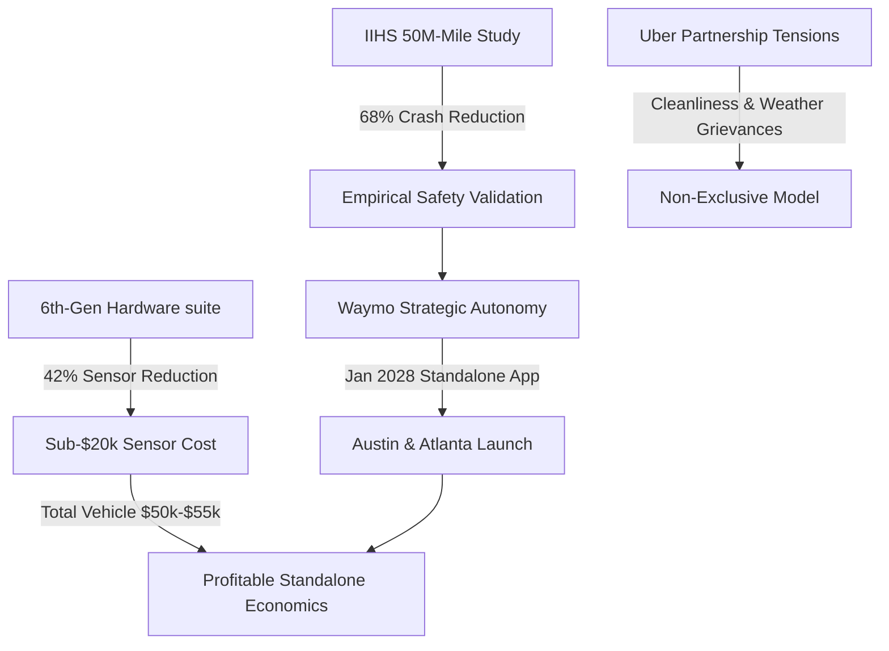

# **The Standalone Bet: Inside Waymo’s 50-Million-Mile Safety Triumph and Its Strategic Rift with Uber**

###

The autonomous vehicle (AV) industry has reached its most critical inflection point. In July 2026, the Insurance Institute for Highway Safety (IIHS) published a landmark study titled *"Rise of the Machines: Crash Experiences of Highly Automated Vehicles and Human Drivers."* By analyzing approximately 50 million miles of driverless operations between 2021 and 2024, researchers compared Waymo’s real-world safety record against 222 billion miles of human driving data across Phoenix, Los Angeles, San Francisco, and Austin. The result is an empirical milestone: Waymo demonstrated a **68% reduction in police-reportable crashes** compared to human drivers.

For Silicon Valley's tech leadership, the data represents a shift from speculative AI hype to physical reality. Box CEO Aaron Levie recently noted, *"Taking a Waymo in San Francisco feels like living in the future, while half the AI apps on my phone feel like features looking for a product."* 

However, this public safety triumph is occurring alongside a major strategic conflict. Waymo has notified Uber of its intent to launch its own standalone app in Austin and Atlanta in January 2028—the earliest date permitted by their contract—effectively ending their exclusivity arrangement. As relations between the two transport giants sour over unit economics and control of the customer relationship, the industry faces a fundamental question: Can a standalone robotaxi service achieve the density and utilization rates needed to be profitable without Uber's massive marketplace?



#### Demystifying the IIHS Safety Methodology
To appreciate the IIHS findings, one must analyze how the study normalized comparisons. Historically, AV operators faced skewed comparisons because federal mandates force them to report every minor incident, from low-speed curb strikes to minor bumper scrapes. Human drivers almost never report such incidents.

To construct an "apples-to-apples" comparison, the IIHS filtered the datasets to include only "police-reportable" crashes—those involving injuries, towed vehicles, or significant property damage. Under this rigorous lens, Waymo's safety advantages became clear:
*   **Overall Crash Rate:** 68% lower than human drivers.
*   **Single-Vehicle Crashes:** 85% lower, highlighting the elimination of human distraction, drowsiness, and impairment.
*   **Injury-Causing Crashes:** 81% lower.

Yet, the regional data reveals significant variations. Waymo achieved a **76% reduction in Phoenix** and a **71% reduction in Los Angeles**, but only a **35% reduction in San Francisco**. In Austin, Waymo's crash rate was actually **4% higher** than humans, though researchers cautioned that the Austin sample size was small, representing just 555,000 miles.

> [!NOTE]
> The lower reduction rate in San Francisco (35%) highlights the physical limits of current AV architectures. The city's hilly terrain, persistent coastal fog, and dense pedestrian traffic present continuous edge cases that test the limits of sensor fusion pipelines.

#### The Hardware Economics of the 6th-Gen Driver
Safety is only half the equation; the other half is capital efficiency. Waymo’s 5th-generation platform, integrated into the Jaguar I-PACE, carried an estimated hardware and sensor suite cost exceeding $150,000 per vehicle. At that price point, scaling a profitable fleet was impossible.

Waymo's 6th-generation "Waymo Driver" system solves this by introducing a **42% reduction in total sensor count** through custom silicon and optimized sensor placement:
*   **13 Cameras:** Upgraded to next-generation 17-megapixel imagers with superior dynamic range, reducing the number of cameras required for 360-degree coverage.
*   **4 LiDAR Sensors:** Down from five in the previous generation, optimized for centimeter-scale urban tracking.
*   **6 Radar Units & External Audio Receivers (EARs):** Providing surround-view radar and localized sirens detection.

This redesigned suite costs **under $20,000 per unit**, cutting sensor costs by over 50%. When paired with new platforms like the purpose-built Zeekr vehicle ("Ojai") or the Hyundai IONIQ 5, the total cost of a fully equipped robotaxi drops to **$50,000–$55,000**. This economic shift is what allows Waymo to target an ambitious **1 million paid rides per week by the end of 2026**.

#### The Uber Rift: Ownership of the Customer Relationship
With hardware costs falling, the battleground has shifted to network density. Waymo's current Austin and Atlanta operations are booked exclusively through the Uber app. However, Waymo's decision to launch its standalone app in January 2028 (while remaining non-exclusively on Uber until the contract concludes in May 2028) indicates a desire to bypass the middleman.

The partnership has reportedly soured over operational and financial friction. Uber has criticized the "unsustainable financial terms" of the deal and noted instances where Waymo vehicles became unavailable during bad weather. In contrast, Waymo has raised concerns about vehicle routing and cleanliness in Uber-managed depots. 

By going standalone, Waymo wants to own the consumer relationship and capture 100% of the fare. However, building ride-hailing liquidity from scratch is incredibly difficult. Without Uber's massive passenger network, Waymo risks low utilization rates—the single biggest driver of fleet unprofitability.

To hedge this risk, Waymo is testing alternative models, partnering with Lyft in Nashville for 2026. Under this deal, Lyft’s fleet subsidiary Flexdrive operates an 80,000-square-foot depot near Nashville International Airport to charge and maintain Waymo's fleet. On the *BG2* podcast, Altimeter Capital's Brad Gerstner noted that the autonomous race is transitioning from software development to fleet operations, where the player that can balance vehicle utilization and maintenance costs will ultimately dominate.

#### Local Opposition and the Federal Preemption Battle
As Waymo prepares to scale to San Diego and Denver, it faces increasing political headwinds. In San Francisco, Mayor Daniel Lurie led a municipal backlash following the "July 4th Meltdown," where multiple Waymo vehicles became immobilized in heavy waterfront traffic, trapping public transit shuttles and requiring tow trucks. This has re-energized groups like *Safe Street Rebel*, which advocates for pedestrian-first streets and uses orange traffic cones placed on vehicle hoods to confuse sensor arrays and trigger safety halts.

In response, California State Senator Dave Cortese introduced SB 1246, which would require AV companies to implement protocols for promptly moving stalled vehicles. Locally, Y Combinator CEO Garry Tan has criticized municipal restrictions, such as SFO airport's decision to restrict Waymo pickups to the Rental Car Center instead of the main rideshare garage, labeling it as *"incumbent protection, pure and simple."*

```
                             REGULATORY MATRIX (2026)
┌───────────────────────────┬─────────────────────────────────────────────────┐
│ Jurisdiction / Initiative │ Key Provisions & Strategic Impact               │
├───────────────────────────┼─────────────────────────────────────────────────┤
│ D.C. Council Bill 26-0684 │ Establishes a commercial regulatory pathway;    │
│                           │ addresses "deadheading" and service equity.     │
├───────────────────────────┼─────────────────────────────────────────────────┤
│ Federal H.R. 7390         │ The SELF DRIVE Act; modernizes safety standards │
│                           │ and establishes federal preemption over cities. │
├───────────────────────────┼─────────────────────────────────────────────────┤
│ Federal S. 4429           │ Connected Vehicle Security Act; bans import of  │
│                           │ Chinese autonomous vehicle software/hardware.   │
└───────────────────────────┴─────────────────────────────────────────────────┘
```

The regulatory outcome remains uncertain. Federal efforts like the SELF DRIVE Act of 2026 (H.R. 7390) aim to establish federal preemption to prevent cities from stalling deployments, but they face significant legislative hurdles. 

This regulatory debate highlights the fundamental division in autonomous vehicle strategy. Tesla CEO Elon Musk has long criticized Waymo’s reliance on HD maps, arguing that geofenced approaches "never really had a chance" compared to Tesla’s vision-only, end-to-end neural network strategy. Yet, as the IIHS study demonstrates, Waymo’s structured, deterministic approach has provided the first validated safety record in the industry. As the technology scales, the winner of the robotaxi race will not just be the company with the best AI, but the one that successfully navigates local municipal opposition, hardware economics, and the challenges of independent fleet operations.

***

## 4. Highlight

### 4.1 Key Questions
1. How does the 6th-generation Waymo Driver reduce sensor costs by over 50% while maintaining safety?
2. Can Waymo's standalone app achieve profitable utilization rates without relying on Uber's passenger network?
3. Will federal preemption under the SELF DRIVE Act override municipal opposition to robotaxis in cities like San Francisco?

### 4.2 Highlight Text
The robotaxi industry has reached an inflection point. The July 2026 IIHS study of 50 million driverless miles confirms Waymo achieves a 68% reduction in police-reportable crashes compared to humans. Yet, as Waymo prepares for a strategic split from Uber in Austin and Atlanta by January 2028, it faces a massive scaling challenge. Can Waymo's 6th-gen hardware suite—which slashes vehicle costs to $50k—unlock unit economics on a standalone app, or will municipal opposition and the lack of Uber's passenger density stall its path to profitability? Here is our deep dive.

### 4.3 Hashtags
#AutonomousVehicles #Waymo #Robotaxis #FutureOfMobility #TechPolicy
