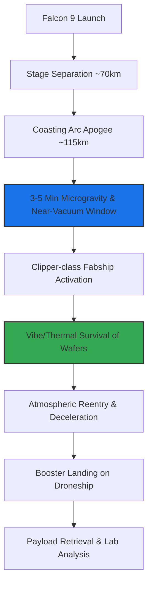

# **The Suborbital Foundry: Inside Besxar’s Audacious Plan to Turn Falcon 9 Boosters Into Space-Based Chip Fabs**

####

On July 5, 2026, at 6:50 a.m. EDT, SpaceX’s Falcon 9 booster B1090 lifted off from Space Launch Complex 40 (SLC-40) at Cape Canaveral. While the primary mission—designated Starlink 10-50—successfully delivered 29 Starlink satellites into low-Earth orbit, the real technical milestone was quietly riding piggyback on the exterior of the first-stage booster. Bolted within the booster's unpressurized utility bays were two microwave-sized, autonomous manufacturing pods: the "Clipper-class" Fabships designed by Washington, D.C.-based startup Besxar Space Industries.

Founded in 2023 by Ashley Pilipiszyn, a former early employee and technical director to the CTO at OpenAI, Besxar is pioneering a radical departure from traditional in-space manufacturing (ISM): using the reusable first stage of an orbital class rocket as a suborbital fabrication platform. This flight marked the first practical test of suborbital, space-based semiconductor hardware, igniting a fierce debate across Silicon Valley and online forums like Reddit’s r/space and r/hardware regarding the physics, logistics, and economics of making chips in the upper atmosphere.



##### The Molecular Physics: Why Gravity is the Enemy of Semiconductors
To understand why Besxar is launching hardware on a rocket booster, one must look at the physical limitations of growing semiconductor crystals on Earth. The fabrication of high-purity compound semiconductor substrates—such as Gallium Arsenide (GaAs) and Indium Phosphide (InP)—is severely degraded by gravity-driven phenomena, specifically buoyancy-driven convection and sedimentation.

During terrestrial crystal growth (e.g., using Czochralski or Bridgman melt methods), thermal gradients within the liquid melt create density differences. The dimensionless Rayleigh number ($Ra$), which dictates the onset of buoyancy-driven convection, is expressed as:

$$Ra = \frac{g \beta \Delta T L^3}{\nu \alpha}$$

Where $g$ is the acceleration due to gravity, $\beta$ is the thermal expansion coefficient, $\Delta T$ is the temperature differential across the melt, $L$ is the characteristic length scale of the crucible, $\nu$ is the kinematic viscosity, and $\alpha$ is the thermal diffusivity.

On Earth, where $g \approx 9.81 \text{ m/s}^2$, the Rayleigh number easily exceeds the critical threshold for turbulent flow. This buoyancy-driven convection causes chaotic thermal oscillations at the solid-liquid growth interface. As a result, dopants distribute unevenly, creating micro-scale "striations" and structural dislocation densities of $10^4$ to $10^6 \text{ cm}^{-2}$. These crystalline defects act as charge-carrier traps, limiting electron mobility and increasing leakage currents—fatal flaws for high-performance quantum computing qubits, high-frequency RF telecommunications (MMICs), and high-power AI accelerators.

In the microgravity environment of space ($g \approx 10^{-5}$ to $10^{-6} \text{ g}$), the Rayleigh number drops toward zero ($Ra \to 0$). Buoyancy-driven convection is suppressed, leaving heat and mass transport dominated entirely by diffusion. The solid-liquid interface remains thermally stable, allowing crystals to grow with uniform dopant distribution and near-zero dislocation densities ($< 10^2 \text{ cm}^{-2}$). Additionally, the absence of sedimentation prevents the phase separation of constituent materials with different densities, enabling the synthesis of highly homogeneous compound alloys.

##### The Engineering Challenge: Surviving the "Ultimate Egg Drop"
Besxar’s Clipper-class Fabships are autonomous, self-contained vacuum chambers designed to survive the harsh mechanical environment of a rocket booster flight. 

```
+-------------------------------------------------------------+
|               Clipper-class Fabship (Microwave Size)        |
|                                                             |
|   +-----------------------+     +------------------------+  |
|   | Active Vibration      |     | Phase-Change Thermal   |  |
|   | Isolation System      |     | Heat Sink              |  |
|   +-----------+-----------+     +-----------+------------+  |
|               |                             |               |
|               v                             v               |
|   +------------------------------------------------------+  |
|   |         Hermetically Sealed Growth Chamber           |  |
|   |  - Wafer substrate carriage                          |  |
|   |  - Miniaturized deposition heating element           |  |
|   +---------------------------+--------------------------+  |
|                               |                             |
|                               v                             |
|                  +--------------------------+               |
|                  | Automated Venting Valves |               |
|                  +------------+-------------+               |
|                               |                             |
+-------------------------------|-----------------------------+
                                v Outward to Space Vacuum
```

To validate their hardware, Besxar's engineering team had to address three primary hurdles:
1. **Mechanical Isolation:** The pods must shield delicate semiconductor wafers and deposition hardware from the violent acoustics (up to 140 dB) and structural vibrations (peaking at 6G of acceleration) of launch, staging, and booster landing. CEO Ashley Pilipiszyn aptly described the design process as "the ultimate egg drop challenge."
2. **Thermal Dynamics:** The exterior of a Falcon 9 booster experiences skin temperatures approaching 1000°C during atmospheric reentry. The Fabships use vacuum-insulated double-walled chambers and phase-change materials to isolate the internal growth zone (which needs to maintain precise temperatures up to 1000°C for crystal growth) from both external reentry friction and the freezing vacuum of space.
3. **Automated Venting:** The pods feature high-speed venting valves designed to open during the booster's apogee, exposing the growth chamber to the ambient space vacuum, and sealing hermetically before the booster reenters the dense layers of the atmosphere.

##### The Suborbital flight Profile: A "Dirty" and Brief Window
The primary technical controversy surrounding Besxar's approach is the highly constrained flight profile. The booster's trajectory lasts just 8 minutes and 19 seconds from launch to droneship landing. The coast phase above the Kármán Line (100 km) provides only a 3 to 5-minute window of microgravity and vacuum.

On Reddit's r/hardware, engineers expressed deep skepticism about the material throughput of such a short flight:

> "Epitaxial growth via Metalorganic Chemical Vapor Deposition (MOCVD) typically proceeds at rates of 1 to 5 microns per hour. In a 3-minute suborbital window, you are growing at most 80 to 250 nanometers of material. You cannot grow a commercial wafer in this time; at best, this is a hardware survivability check or a precursor nucleation test."

Furthermore, the vacuum environment around a returning booster is far from clean. During its coast, the booster is surrounded by outgassing kerosene soot, vaporized hydraulic fluids, and cold-gas nitrogen thruster plumes. This creates a localized, transient atmosphere (a "dirty vacuum" wake) with local pressures spiking to $10^{-3}$ Torr. Besxar's pods must remain sealed during engine burns and thruster firings to prevent contamination, narrowing the usable growth window even further.

##### Comparative Economics: Space-Based vs. Terrestrial Fabs
The economic case for space-made chips must be weighed against advanced terrestrial cleanrooms and orbital competitors:

| Metric / Parameter | Besxar (Suborbital Booster) | Varda Space / Space Forge (Orbital Capsule) | Advanced Terrestrial Fab (TSMC / Intel) |
| :--- | :--- | :--- | :--- |
| **Microgravity Duration** | 3 – 5 minutes | Weeks to Months | None (Gravity-driven convection) |
| **Vacuum Quality** | Transient, dirty ($10^{-3}$ to $10^{-5}$ Torr) | Pristine LEO vacuum ($10^{-9}$ to $10^{-10}$ Torr) | Engineered UHV ($10^{-7}$ to $10^{-9}$ Torr) |
| **Launch & Recovery Cost** | Ultra-low (Piggyback on reusable booster) | High (Dedicated capsule + reentry shield) | None |
| **Regulatory Hurdles** | Low (Booster landing is routine) | High (FAA/AST reentry licensing) | Standard industrial compliance |
| **Throughput / Scalability**| Extremely low (Test-bed scale) | Low (Capsule-sized batches) | High (Thousands of 300mm wafers/day) |

Delian Asparouhov, Partner at Founders Fund and Co-Founder of Varda Space Industries, has been highly vocal about the economics of material synthesis in space. In a discussion on X, Asparouhov noted:

> "The physics of microgravity are real, but material synthesis is a function of time. You need dwell time to grow high-value crystal ingots. Suborbital flights are excellent for vibe-testing your actuators and valve seals, but to make the economics work for materials worth $100,000/kg, you need to stay in orbit."

However, Varda’s approach requires expensive, dedicated reentry capsules that face strict FAA reentry licensing hurdles. By contrast, Besxar bypasses reentry licensing because the booster landing is already approved and routine. 

Furthermore, Besxar’s long-term economic model is not about growing full wafers in space. Instead, they aim to grow ultra-pure "seed" crystals during these suborbital sprints. These perfect crystal seeds can be returned to Earth and used in terrestrial Czochralski pullers to grow large, low-defect ingots at scale. This "space-seeded, Earth-grown" hybrid model could allow Besxar to leverage the purity of space while maintaining the scale and throughput of terrestrial fabs.

With backing from SpaceX, Nvidia’s Inception program, and a fresh contract with the U.S. Navy, Besxar has secured 11 more Falcon 9 flights to iterate on its Clipper-class platform. Whether they can successfully grow flawless semiconductor seeds in 240 seconds remains to be seen, but the race to establish the first commercial space-based foundry is officially underway.

***

### 4. Highlight

#### 4.1 Key Questions
1. How does Besxar plan to grow high-quality semiconductor crystals in a suborbital flight window lasting only 3 to 5 minutes?
2. How does the company protect delicate wafers and deposition chambers from the massive vibrational shocks and reentry heating of the Falcon 9 booster?
3. Can space-seeded, suborbitally synthesized crystals compete economically with terrestrial fabrication techniques like Magnetic Czochralski (MCZ) growth?

#### 4.2 Highlight Text
On July 5, 2026, Besxar Space Industries successfully launched two "Clipper-class" manufacturing pods integrated directly onto a SpaceX Falcon 9 first-stage booster. By utilizing the booster's suborbital coast phase, Besxar aims to exploit microgravity and space vacuum to grow ultra-pure semiconductor substrates free from gravity-driven thermal convection. While critics question the brief 3-5 minute manufacturing window and the "dirty vacuum" surrounding the booster, Besxar's hybrid model aims to produce flawless "seed" crystals in space for large-scale terrestrial scaling, bypassing the high costs of orbital reentry capsules.

#### 4.3 Hashtags
#Semiconductors #SpaceX #Microgravity #InSpaceManufacturing #DeepTech #HardwareEngineering
