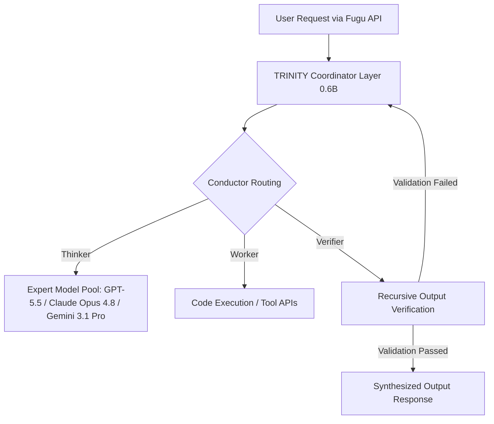

# **The Swarm Arbitrage: Inside Sakana AI's Multi-Agent Rebellion Against the Monolith**

##

June 2026 has marked a structural fracture in the monolithic artificial intelligence consensus. For the past three years, Silicon Valley’s playbook was simple: stack more FLOPs, scale the parameters, and train increasingly massive monolithic transformers. But a double-whammy of geopolitical restrictions and architectural bottlenecks has shattered that trajectory. On June 12, 2026, the US Department of Commerce tightened export controls, restricting access to frontier monolithic models like Anthropic's Fable 5 and Mythos Preview. 

Ten days later, on June 22, Tokyo-based Sakana AI launched **Sakana Fugu** (and its high-reasoning tier, **Fugu Ultra**), an API-driven multi-agent orchestration and routing platform. Combined with their June 15 launch of **Sakana Marlin**—an autonomous B2B "Virtual CSO" research agent—Sakana is betting the farm on nature-inspired "swarm intelligence." 

The core issue: Can coordinated swarms of smaller, swappable models actually replace the general intelligence of frontier monolithic giants, or will API latency, token overhead, and coordinating complexity render swarms commercially unviable?

### The Architecture of the Conductor: TRINITY and Reinforcement Learning
Unlike traditional foundation models, Sakana Fugu does not exist as a single, massive neural network. Instead, it functions as a learned coordination layer delivered via a single, OpenAI-compatible API endpoint. Under the hood, Fugu relies on two seminal papers presented by Sakana researchers at ICLR 2026: **TRINITY** and **Conductor**.

1. **TRINITY:** A lightweight (~0.6B parameter) coordinator model that acts as the traffic controller of the swarm. It dynamically categorizes incoming user prompts and assigns specialized roles—such as "Thinker," "Worker," and "Verifier"—to models within the agent pool.
2. **Conductor:** A model trained via reinforcement learning (RL) that discovers natural-language coordination strategies. Rather than relying on rigid, hard-coded execution graphs, Conductor learns how to construct targeted prompts, route tasks, and handle recursive self-calls at runtime depending on the problem's complexity.



As Sakana AI CTO **Llion Jones** posted on X: 
> *"Attention was about scaling context; now, the bottleneck is scaling coordination. Conductor and TRINITY prove that a 0.6B coordinator can extract frontier-level reasoning from a pool of smaller, cheaper models by dynamically structuring the communication topology."*

### Marlin: Inference-Time Compute and AB-MCTS
While Fugu coordinates real-time API calls, Sakana Marlin represents the extreme extension of "inference-time compute." Built for deep, long-horizon B2B strategic planning, Marlin functions as a Virtual Chief Strategy Officer. A user inputs a high-level research theme, and Marlin runs a self-governing loop for up to **eight hours**, generating a comprehensive 60- to 100-page strategic report complete with executive presentation slides.

Marlin’s engine is built on **Adaptive Branching Monte Carlo Tree Search (AB-MCTS)**, paired with workflow automation derived from Sakana's "AI Scientist" project. Instead of committing to a single linear chain of thought, Marlin treats reasoning as a game tree. It evaluates multiple potential hypotheses, prunes dead-end reasoning paths, and dynamically delegates sub-problems to specialized models in the background.

```
Marlin Reasoning Tree (AB-MCTS)
         [Initial Research Goal]
               /         \
    [Hypothesis A]     [Hypothesis B]
         /     \             |
    [Pass]   [Pruned]   [Verify Loop]
                         /         \
                   [Strategy Slide] [100-page Report Draft]
```

AI pioneer **Andrew Ng** observed:
> *"Marlin and Fugu Ultra are concrete proof points that agentic workflows and multi-agent coordination are the fastest paths to frontier-level performance. We are seeing compute shift decisively from training-time pre-training to inference-time execution."*

### Benchmark Showdown: Fugu Ultra on SWE-bench Pro
To prove the viability of this swarm architecture, Sakana AI benchmarked **Fugu Ultra** on **SWE-bench Pro**, a rigorous coding benchmark. According to vendor-reported data, Fugu Ultra achieved a score of **73.7%**, outperforming several standalone flagship models:

*   **Fugu Ultra (Swarm Orchestrator):** 73.7%
*   **Claude Opus 4.8 (Monolith):** 69.2%
*   **GPT-5.5 (Monolith):** 58.6%
*   **Gemini 3.1 Pro (Monolith):** 54.2%

However, Fugu Ultra still trails Anthropic's restricted **Fable 5**, which sits at **80.0%**. 

Furthermore, prominent AI researchers have urged caution. Meta's Chief AI Scientist **Yann LeCun** commented:
> *"Combining multiple auto-regressive LLMs in a swarm doesn't solve the fundamental lack of a world model. You just get a committee of hallucinating agents correcting each other's hallucinations. However, for deterministic coding tasks like SWE-bench, the iterative verification loop works well."*

### The Economics of the Swarm: Token Bloat and Latency
The primary battleground for swarms is economic. Sakana Fugu Ultra is priced at **$5.00 per 1 million input tokens** and **$30.00 per 1 million output tokens**, with cached inputs priced at **$0.50 to $1.00 per 1M**. 

To entice developers, Sakana implements a **"no stacked fees"** policy: users are only billed the top-tier rate of the models active in the request, rather than paying additive API fees for every sub-agent.

However, the hidden margin-killer is **token bloat**. Because Fugu’s TRINITY and Conductor models recursively call verifiers, rewrite prompts, and branch reasoning paths, a single user query can trigger millions of intermediate "orchestration tokens" behind the scenes. 

As prominent VC investor **Brad Gerstner** pointed out:
> *"The enterprise margin question for multi-agent swarms is brutal. If Fugu Ultra requires 5x to 10x the token volume of a single GPT-5.5 call due to recursive verification, the API costs will eat the developer's margins. The 'no stacked fees' helps, but token bloat is the silent margin killer."*

Additionally, Fugu Ultra introduces significant latency. While the standard Fugu variant is optimized for low-latency interactive tasks, Fugu Ultra is slow, making it unsuitable for real-time applications.

### Swarms as Geopolitical Arbitrage
Perhaps the most intriguing aspect of Sakana’s June 2026 launch is its geopolitical positioning. By utilizing a swappable pool of models, Fugu is designed as a hedge against vendor lock-in and US export controls. 

For enterprises in East Asia or Europe (though Fugu is temporarily blocked in the EU/EEA due to GDPR compliance hurdles), Fugu provides a template for geopolitical arbitrage. If a country is cut off from Anthropic's Fable 5 or OpenAI's flagship models, Fugu can dynamically orchestrate a swarm of smaller, unrestricted or open-weight models (like Llama or Mistral variants) to reconstruct frontier monolithic reasoning capabilities.

As Sakana AI CEO **David Ha** summarized:
> *"Nature doesn't build a single giant brain to run the ocean; it coordinates a school of fish. Fugu is the first step toward a swappable, evolutionary API that makes monolithic lock-in obsolete."*

Whether this swarm approach is a temporary bridge to bypass export controls or the permanent future of software engineering remains the defining question of late 2026.

---

# 4. Highlight

## 4.1 Key Questions
1. Can multi-agent swarms replace the reasoning power of frontier monolithic models?
2. Will the token overhead and latency of recursive verification loops make swarms commercially unviable for enterprises?
3. How can swarms be leveraged as geopolitical arbitrage to bypass strict export controls on frontier AI?

## 4.2 Highlight Text
The monolithic AI era is facing a massive rebellion. Following US export controls restricting frontier models like Anthropic's Fable 5, Sakana AI has launched **Fugu** and **Marlin**. Powered by ICLR 2026 research (TRINITY & Conductor), Fugu Ultra acts as a dynamic coordinator that routes tasks to a swappable pool of smaller models. It scored a vendor-reported **73.7% on SWE-bench Pro**, outperforming GPT-5.5. However, with massive recursive calls comes **token bloat**—a hidden margin-killer. Is swarm orchestration a viable commercial future, or just a temporary workaround for export controls?

## 4.3 Hashtags
#SakanaAI #GenerativeAI #MultiAgentSystems #Fugu #TechSwarms #AIOrchestration
