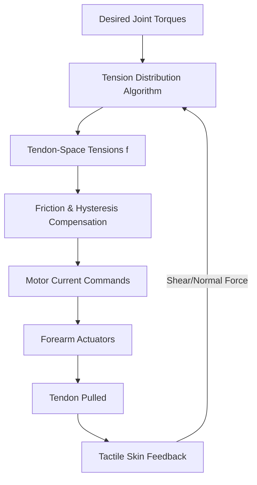

# **The Tendon Gamble: Inside 1X’s 25-DoF Force-Transparent Hand and the Humanoid Dexterity Wars**

##

In the race to put general-purpose humanoid robots into human homes, the ultimate battleground isn’t walks or balances—it’s hands. While leg locomotion has largely converged on quasi-direct-drive (QDD) actuators and reinforcement learning, manipulation remains a wild frontier. The recent release of 1X Technologies’ 25-Degree-of-Freedom (DoF) robotic hand for its NEO humanoid robot has reignited a fierce debate in the robotics community: Can tendon-driven compliance win the domestic market, or will the mechanical complexity of cable arrays derail it at scale?

### The Anatomy of the 1X Tendon Drive
Traditional robotic hands, like the 16-DoF end-effector on the Figure 02, embed rigid electric motors and gearboxes directly inside the fingers. 1X Technologies has taken the opposite approach. The NEO hand features 22 fully actuated degrees of freedom within the palm and fingers, coupled with a 3-DoF wrist, totaling 25 DoF. 

To pack this level of density without creating a heavy, bulbous hand, 1X routes high-strength polymer tendons (typically ultra-high-molecular-weight polyethylene, or UHMWPE, like Dyneema) from actuators situated in the forearm down through the wrist joint. This design mimics the human forearm-to-hand musculo-skeletal system, keeping the hand lightweight, thin, and whisper-quiet (operating at around 22 dB).

### The Physics of "Force Transparency"
The defining feature of the NEO hand is "force transparency." In traditional industrial robotics, joints use high gear ratios (e.g., 100:1 or 200:1 strain wave / harmonic gears) to maximize torque. However, high-reduction gearboxes introduce massive reflected inertia ($J_{reflected} = G^2 \cdot J_{motor}$) and non-linear friction, masking external forces. To know how hard it is pressing, the robot must rely on expensive joint torque sensors or tactile skins.

1X utilizes exceptionally low gear ratios—ranging from 5:1 to 15:1. The relationship between motor current ($I$) and joint torque ($\tau$) is defined by:
$$\tau = K_t \cdot I \cdot G \cdot \eta$$
where $K_t$ is the motor torque constant, $G$ is the gear ratio, and $\eta$ is the transmission efficiency. 

Because $G$ is extremely low and the tendon transmission is highly backdrivable, the reflected friction is negligible. The actuators behave as bidirectional transducers: they can both apply force and accurately "feel" resistance. When the hand collides with a table, the forces are transmitted directly back to the motors in the forearm, allowing the control loop to respond instantly.

### The Control Headache: Hysteresis and Tensioning
While force transparency is a mechanical dream, controlling a 25-DoF tendon network is a software nightmare. Tendon-driven systems face three core challenges:
1. **Unidirectional Actuation:** Tendons can only pull, not push. To actuate a single joint bidirectionally, you need an antagonistic pair of tendons (like human biceps and triceps), or a spring-return mechanism.
2. **Coupling:** Routing 22 tendons through a 3-DoF wrist means that flexing the wrist changes the path length—and therefore the tension—of the finger tendons.
3. **Elongation and Hysteresis:** Even high-modulus polymer cords undergo elastic deformation and creeping over time.

To prevent tendons from derailing or going slack, 1X implements a Tension Distribution Algorithm (TDA). The TDA maps the desired joint-space torques ($\tau$) to tendon-space tensions ($f$) through the structure matrix $W^T(\theta)$:
$$\tau = W^T(\theta) f$$
Subject to the constraint:
$$f_{min} \le f \le f_{max}$$
where $f_{min} > 0$ ensures the cables never go slack.

Additionally, to counteract friction and hysteresis within the tendon sheaths, control engineers must employ dynamic models like the **LuGre friction model** for feed-forward compensation, and **Bouc-Wen models** to predict hysteretic behavior during rapid loading cycles.

### The Tactile Layer and IP68 Compliance
Complementing the low-reduction actuators is a multi-modal tactile sensing skin wrapped around the fingers. Rather than relying on simple binary contact switches, NEO's fingertips measure normal force, contact location, and shear force. Shear force detection is the holy grail of in-hand manipulation; it allows the control system to detect *incipient slip*—the micro-vibrations that occur just before an object drops—and dynamically tighten its grip.

Crucially for domestic deployment, the entire hand is IP68-sealed and wrapped in a washable, food-safe polymer "flesh." CEO Bernt Børnich has repeatedly stressed that washability is a non-negotiable requirement for home robots. "If a robot cannot wash dishes, handle raw chicken, and be cleaned under a faucet without shorting its electronics, it cannot exist in a kitchen," Børnich has argued.

### The Great Humanoid Debate: Tendons vs. Rigid QDD vs. Hydraulics
The robotics industry is sharply divided on the best path to hand dexterity:
*   **Tesla Optimus (Gen 3):** Tesla has shifted to a 22-DoF hand, also routing cables from forearm actuators. Like 1X, Tesla is betting on the forearm-tendon layout to keep finger inertia low, but their focus is heavily optimized for automotive manufacturing assembly and extreme volume scaling.
*   **Figure 02:** Brett Adcock’s team opted for 16-DoF hands with QDD motors embedded directly inside the fingers. Proponents of this architecture argue it eliminates the routing nightmare of tendons, avoids cable wear, and simplifies calibration.
*   **Sanctuary AI (Phoenix):** Geordie Rose has historically favored hydraulic actuators. Hydraulics offer unmatched power density and speed, but critics point to leak risks and the complexity of routing pressurized fluid lines in a home setting.

On social media and Reddit's `r/robotics`, hardware engineers have expressed deep skepticism about 1X’s tendon reliability. One top comment read: *"Twenty-five tendons routing through a moving wrist is a ticking maintenance bomb. If one polymer cable snaps or stretches beyond the calibration limits, the entire hand goes limp."*

Conversely, former VP of AI at 1X, Eric Jang, has pointed out that the hardware's complexity is offset by 1X's "data engine" approach. By utilizing human teleoperation to gather large datasets, the AI learn to control the compliant hands directly from data, bypassing the need for perfect analytical kinematic models.

### Production and Market Outlook
1X is manufacturing these hands in-house at their Hayward, California and Norway facilities. However, transitioning from hand-assembled research prototypes to producing thousands of IP68-certified, tendon-driven humanoids is a monumental manufacturing hurdle. If 1X can prove that their UHMWPE tendons can withstand millions of cycles without snapping, they will have set the gold standard for domestic safety. If not, they may be forced to retreat to simpler, more rigid planetary gearboxes.

***

# 4. Highlight

## 4.1 Key Questions
1. How does 1X Technologies achieve force transparency and backdrivability in the NEO humanoid hand?
2. What are the key control and calibration challenges of routing 25 tendon lines through a 3-DoF wrist?
3. How does the tendon-driven approach of the 1X NEO and Tesla Optimus Gen 3 compare to the rigid, in-finger actuators of Figure 02?

## 4.2 Highlight Text
Humanoid hand design is fracturing. While @Figure_robotics embeds rigid actuators directly in the fingers of Figure 02 for industrial simplicity, @1X_Technologies (backed by OpenAI) and Tesla are going all-in on forearm-based tendon drives. 1X’s new 25-DoF hand achieves complete "force transparency" using low gear ratios (5:1 to 15:1), turning its motors into bidirectional sensors. But the trade-off is a control nightmare: hysteresis, cable elongation, and routing 22 tendons through a 3-DoF wrist. Can a washable, IP68-sealed hand survive domestic environments, or will tendon fatigue snap the humanoid dream? 

## 4.3 Hashtags
#Robotics #HumanoidRobots #ControlTheory #MechanicalEngineering #Hardware
