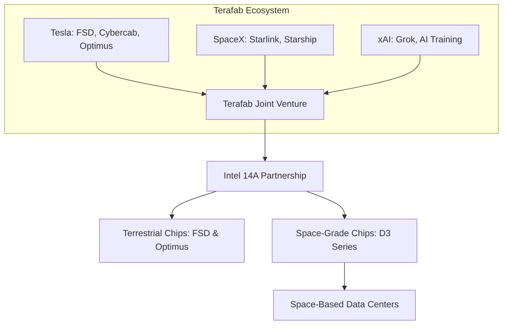

# The Texas Monolith: Inside Elon Musk's $119 Billion 'Terafab' Gamble and the Space-Based AI Frontier

##

An interactive version of this blog post has been saved as a markdown artifact: [terafab_deep_dive.md](file:///Users/vzl/.gemini/antigravity-cli/brain/7730d47b-b6ae-4f35-b17b-92d3b1c576bd/terafab_deep_dive.md).

On March 21, 2026, Elon Musk unveiled a project of staggering scale: the **Terafab**. Orchestrated as a joint venture between Tesla, SpaceX, and xAI, this initiative aims to establish a fully vertically integrated semiconductor manufacturing ecosystem in Texas. The goal is simple yet monumentally difficult: to achieve complete "compute sovereignty" by consolidating the entire silicon lifecycle—from design and High-NA EUV lithography to fabrication, memory integration, and advanced packaging—under a single corporate umbrella. 

Currently, the coalition operates pilot lines at Tesla's Giga Texas campus in Austin, with plans to construct a massive $119 billion fabrication complex in Grimes County, near the Gibbons Creek Reservoir. The primary objective is to produce 1 terawatt (TW) of compute capacity annually, generating hundreds of billions of custom terrestrial and space-grade chips. To lead this charge, Tesla hired Gary Jiang, a 17-year Intel veteran who managed the rollout of Intel's 18A process node at its Arizona Ocotillo facility. Terafab has also forged a strategic alliance with Intel to license its advanced **14A process node**, marking a critical test for Pat Gelsinger’s Intel Foundry business.

### The Technical Stack: Vertical Integration at the 14A Frontier
Vertical integration in the semiconductor industry is notoriously difficult. Historically, the industry has migrated toward a highly specialized, decentralized model: companies like Apple and Nvidia design silicon, ASML manufactures lithography tools, TSMC fabricates the physical wafers, and OSATs (Outsourced Semiconductor Assembly and Test) handle packaging. Musk’s Terafab plans to bypass this paradigm entirely.

Leveraging Intel’s 14A node, the project will be the first non-Intel initiative to native-design for High Numerical Aperture (High-NA) EUV lithography. The 14A process utilizes Intel's RibbonFET (Gate-All-Around) architecture and PowerVia (backside power delivery), which separates power routing from signal routing to boost clock speeds and reduce voltage droop. 

Additionally, Terafab is attempting to integrate High Bandwidth Memory (HBM4) production. Unlike HBM3, which relies on microbumps, HBM4 moves to a 2048-bit interface, demanding direct copper-to-copper hybrid bonding onto the logic die. Accomplishing this level of co-design and packaging complexity under one roof is unprecedented.

### Gary Jiang and the Intel Alignment
The hire of Gary Jiang as Director of Terafab is a major talent acquisition. Having spent 17 years at Intel, Jiang's experience in managing Arizona's Ocotillo OMT (Ocotillo Manufacturing Technology) fab transition for the 18A node is crucial. He brings the exact operational playbook needed to execute tool hook-ups, gas delivery systems, and cleanroom certification.

Intel CEO Pat Gelsinger has actively promoted this alliance, viewing it as a massive anchor tenant for Intel Foundry Services (IFS). Gelsinger noted on X:
> *"Working with Elon and the Terafab team allows us to refactor silicon fab technology at a scale never before attempted. By pairing Intel’s 14A lithography with Terafab’s vertical packaging, we are pushing the physical boundaries of compute."*

### The Skeptical Consensus: The "Artistry" of Yields
Despite the hire of Jiang and the partnership with Intel, the broader semiconductor community remains deeply skeptical. Semiconductor fabrication is not just a capital problem; it is an operational optimization problem.

Nvidia CEO Jensen Huang has expressed doubts regarding the feasibility of non-traditional players building foundries from scratch, noting:
> *"Building a leading-edge fab is not just about buying machines. It is decades of yield optimization, process tuning, and chemical engineering. Replicating the foundry ecosystem from scratch is virtually impossible."*

Dylan Patel, lead analyst at *SemiAnalysis*, pointed out the sheer capital risk:
> *"Musk’s Terafab is born out of desperation over long-term GPU and TPU capacity constraints. But the capital expenditure required to hit 1 TW of compute annually runs into the hundreds of billions. Even with Intel’s help, yield learning curves at 1.4nm are brutal. If Terafab's yields hover below 50%, the cost per working die will be astronomically higher than sourcing from TSMC."*

### The Space Frontier: Orbital Data Centers
Perhaps the most controversial aspect of the Terafab vision is the deployment of space-grade chips (such as the D3 series) to power orbital, space-based data centers launched by Starship. 

Proponents, including xAI researchers, argue that space-based compute is the ultimate answer to Earth's energy, land, and water constraints. In orbit, solar radiation is constant, and land-use restrictions do not exist. However, engineers on Reddit and X have identified three major physical bottlenecks:

1. **Thermal Dissipation in a Vacuum**: In space, heat transfer via convection is non-existent. Cooling can only occur through radiative heat transfer, governed by the Stefan-Boltzmann law ($P = \epsilon \sigma A T^4$). To dissipate megawatts of heat from high-performance AI chips, orbital data centers will require massive, fragile radiator arrays. As one thermal engineer on Reddit's r/SpaceXMasterrace calculated: *"To cool a modest 10-megawatt space cluster, you need over 30,000 square meters of radiators, creating massive drag in Low Earth Orbit (LEO) and adding structural vulnerability."*
2. **Cosmic Radiation and Single Event Upsets (SEUs)**: High-energy cosmic rays, solar proton events, and trapped radiation in the Van Allen belts present constant hazards. Logic gates at 1.4nm are highly sensitive to single-particle strikes, which cause bit flips (SEUs) and latch-ups. Traditional radiation hardening involves using larger, redundant transistors, which directly conflicts with the performance goals of AI silicon.
3. **Launch Economics**: While Starship has drastically reduced launch costs to under $1,500/kg, *SemiAnalysis*'s "AI Space Datacenter TCO Model" suggests that for orbital compute to achieve cost-parity with a terrestrial data center, launch costs must compress to $100–$200/kg, or the efficiency of orbital solar capture must dramatically outperform terrestrial power grids.

---

# 4. Highlight

## 4.1 Key Questions
1. Can Musk’s "all-under-one-roof" vertical integration model overcome the specialized efficiency of TSMC and the global chip supply chain?
2. How will Gary Jiang adapt Intel’s 14A High-NA EUV lithography roadmap to meet the high-yield scale needed for Tesla and xAI?
3. Will orbital data centers ever solve the laws of thermodynamics (radiative cooling arrays) to justify launch payload costs?

## 4.2 Highlight Text
Elon Musk is taking the ultimate gamble on "compute sovereignty." By launching **Terafab**, a joint venture between Tesla, SpaceX, and xAI, Musk plans a massive $119B fabrication complex in Texas to build custom chips under one roof. Partnering with Intel to license the 14A node and hiring 17-year Intel veteran Gary Jiang, the initiative aims to fuel terrestrial AI and orbital space-based data centers. But industry titans like Nvidia's Jensen Huang remain skeptical: can Musk solve the brutal physics of radiative cooling in space and the steep yield curves of 1.4nm manufacturing?

## 4.3 Hashtags
#Semiconductors #Terafab #AICompute #SpaceTech #IntelFoundry
