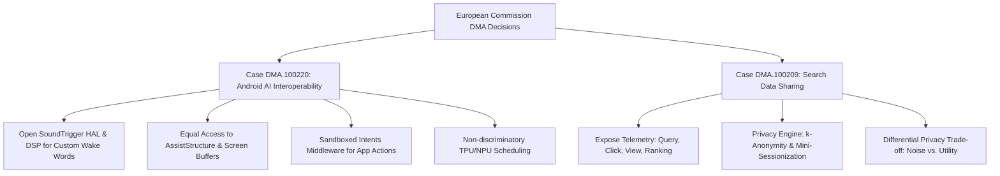

# **Under the Hood of the EU's Google Mandate: Android 18’s Open Assistant Architecture and the Search Data Privacy Paradox**

##

On July 16, 2026, the European Commission issued two landmark binding decisions under the Digital Markets Act (DMA), systematically dismantling Google’s most formidable competitive moats. Under Case DMA.100220, Google is ordered to open 11 key system features within its Android operating system to rival AI assistants—such as OpenAI’s ChatGPT, Microsoft’s Copilot, and Anthropic’s Claude—by August 1, 2027, aligning with the release of Android 18. Simultaneously, Case DMA.100209 forces Google to share its vast repository of search query, click, view, and ranking telemetry with competitor search engines and AI chatbots under fair, reasonable, and non-discriminatory (FRAND) terms by January 2027.

While European regulators hail this as a triumph for digital competition, Google’s President of Global Affairs, Kent Walker, raised immediate alarms, stating the decisions "risk undermining vital privacy and security guardrails for millions of Europeans." 

For system architects and security engineers, these rulings present a web of technical challenges. A deep look under the hood reveals the engineering compromises Google must make to open Android 18’s core and the mathematical limitations of anonymizing search logs at scale.



### Android 18's AI Interoperability: Exposing the OS Core
Currently, Google's Gemini enjoys an exclusive, deep integration with Android. While third-party assistants can register as the default digital assistant using the standard `VoiceInteractionService` API, they are sandboxed from critical OS capabilities. Google must now open 11 key operating system features across four critical layers:

#### 1. Invocation and the DSP Bottleneck
To match Gemini's hands-free voice activation, third-party assistants must be allowed to register custom wake words (e.g., "Hey ChatGPT") that function when the screen is off or the device is in standby. 

In the current Android architecture, this relies on the `AlwaysOnHotwordDetector` API, which binds directly to the privileged `SoundTrigger` Hardware Abstraction Layer (HAL). The `SoundTrigger` HAL manages communication with a dedicated low-power Digital Signal Processor (DSP) on the System-on-Chip (SoC). This DSP continuously monitors a small microphone buffer for a specific acoustic print, consuming only microamps of power. 

Under Android 18, Google must build a standardized API middleware over the `SoundTrigger` HAL, allowing third-party assistants to flash their own acoustic models to the DSP. 

The engineering complexity amplifies for Android 19 (mandated for August 1, 2028), which requires **concurrent hotword detection**. Most modern mobile DSPs are silicon-constrained and optimized to run a single wake-word model. Running three or four models concurrently (e.g., listening for "Hey Google," "Hey Siri," and "Hey ChatGPT" simultaneously) will either require hardware co-processors or software-based audio focus arbitration middleware. Waking up the application processor (AP) to resolve similar-sounding hotwords would destroy standby battery life.

#### 2. Screen Context and the Assist API
Gemini can analyze what is currently displayed on a user's screen to provide context-aware answers. Under the hood, this relies on `AssistStructure` and `AssistContent` APIs. The system captures the current window's serialized view hierarchy and takes a screenshot buffer, passing them to the active voice session.

Android 18 must provide rival assistants with equal access to these raw screen buffers and structural trees. This bypasses the typical Android application sandbox. A third-party AI assistant could theoretically read passwords, financial data, or private chats. While apps can set the `WindowManager.LayoutParams.FLAG_SECURE` flag to prevent screen captures, many apps do not utilize it, shifting the security burden entirely to the assistant’s own developer and the OS's runtime permission prompt.

#### 3. Secure App Actions vs. Accessibility Exploits
To let an AI assistant perform actions within other apps—such as sending a message on WhatsApp or booking a ride on Uber—Gemini uses Google’s proprietary App Actions. Third-party developers currently rely on `AccessibilityService` APIs to automate UI clicks. However, accessibility APIs are highly privileged and represent the primary vector for Android banking trojans and overlay attacks.

To satisfy the DMA without exposing users to severe security threats, Google must develop a new, sandboxed intent-dispatching and UI-automation middleware. This middleware must translate an assistant's high-level intent (e.g., `ACTION_SEND_MESSAGE`) into structured OS commands, executing them on behalf of the user without granting the assistant raw view-tree manipulation or touch-event injection privileges.

#### 4. Silicon Resource Allocation
On-device models (like Gemini Nano) run with elevated OS priority. Android 18 must allocate TPU/NPU compute cycles and memory pinning (`mlock`) to competitor models on non-discriminatory terms. Under high memory pressure, third-party assistant processes must not be aggressively terminated by the Low Memory Killer (LMK) while Gemini is kept alive in high-priority `SCHED_FIFO` cgroups.

### The Differential Privacy Paradox of Search Data Sharing
Case DMA.100209 aims to break Google’s "search flywheel"—the compounding advantage where billions of search queries and subsequent click-through rates (CTR) are used to continuously train Google's ranking models. Starting in January 2027, Google must share this ranking, query, click, and view telemetry under FRAND terms.

However, search queries are rich in semantic context and highly unique. The 2006 AOL search data leak proved that simple pseudonymization (replacing usernames with numeric IDs) is useless. Researchers easily identified User 4417749 as Thelma Arnold by cross-referencing her queries containing local landmarks and family names with public phone records.

To prevent re-identification, the European Commission proposed a multi-layered anonymization regime:
* **Attribute Suppression**: Stripping IP addresses, precise geolocations, and unique user-agent strings.
* **$k$-Anonymity**: Suppressing any query that does not appear at least $k$ times (e.g., $k=30$) in a specific window.
* **Mini-Sessionization**: Splitting a user's search history into disconnected, short windows of 2-3 queries to prevent search-path correlation.

Despite these measures, Google’s top differential privacy researcher, Sergei Vassilvitskii, warned that Google’s red team successfully bypassed the EC's proposed anonymization scheme, re-identifying users within two hours using linkage attacks against auxiliary public datasets (such as geolocated social media check-ins).

```
Typical Query Log:
[User ID: 88471] -> "symptoms of lymphoma" -> "lymphoma specialist in Munich" -> "Dr. Hans Weber reviews"
          |
          v (Mini-Sessionization & k-Anonymity)
Shared Log:
[Session A] -> "symptoms of lymphoma" (Shared, high volume)
[Session B] -> "lymphoma specialist in Munich" (Shared, medium volume)
* "Dr. Hans Weber reviews" (SUPPRESSED: Query count < k)
```

The gold standard for solving this is **Differential Privacy (DP)**, which injects mathematical noise (Laplace or Gaussian) to guarantee that the presence or absence of any single user's data does not significantly alter the output of queries on the dataset. However, search query distributions follow a power-law curve with an extremely long tail; roughly 15% of searches Google sees every day have never been searched before. 

Applying a strict DP mechanism with a low privacy budget ($\epsilon$) requires suppressing or heavily scrambling these tail queries. Because the value of search telemetry lies precisely in these rare, high-intent tail queries, applying sufficient noise to guarantee privacy renders the dataset virtually useless for training competing search engines or AI retrieval models.

### Strategic Market Implications
The DMA mandates represent an unprecedented threat to Google’s core business model. By forcing the virtualization of the Android assistant layer and the democratization of search logs, the EU is lowering the barrier to entry for AI search engines.

Perplexity CEO Aravind Srinivas highlighted the magnitude of this shift:
> "Access to high-quality search query and click data under FRAND terms is a game-changer for search startups. It levels the playing field against a gatekeeper that has spent 25 years accumulating a proprietary user-feedback loop."

Conversely, Kent Walker defended Google's resistance:
> "Exposing private user search data to unfamiliar companies under the guise of competition puts user safety at risk. Furthermore, forcing deep, unvetted access to system components like the microphone, screen, and sensors bypasses the sandbox protections that keep Android secure."

The intersection of the DMA, system architecture, and cryptographic privacy limits has created a high-stakes engineering battleground. As Google builds the APIs for Android 18 and prepares the FRAND search data pipelines for 2027, the tech community will watch closely to see if the operating system can remain secure and private when its core is forced open.

***

# 4. Highlight

## 4.1 Key Questions
1. How will Android 18 safely expose screen buffers (`AssistStructure`) to third-party AI assistants without introducing massive data-exfiltration vulnerabilities?
2. Can Google build a low-power, multi-tenant DSP middleware for Android 19 that supports concurrent wake-word detection without draining mobile batteries?
3. Is it mathematically possible to apply Differential Privacy to search query logs without destroying the utility of the long-tail search data needed by competitors?

## 4.2 Highlight Text
The European Commission's DMA rulings on Google (Cases DMA.100220 & DMA.100209) are set to reshape the AI ecosystem. By forcing Google to open Android 18’s core (including the `SoundTrigger` HAL and screen buffers) and share search logs under FRAND terms, the EU is lowering the barrier for competitors like OpenAI, Microsoft, and Perplexity. However, this creates massive engineering hurdles: concurrent hotword detection threatens standby battery life, and applying strict Differential Privacy to search logs reveals a stark trade-off between user privacy and data utility.

## 4.3 Hashtags
#TechAntitrust #Android18 #DifferentialPrivacy #DigitalMarketsAct #AIInteroperability #Infosec
