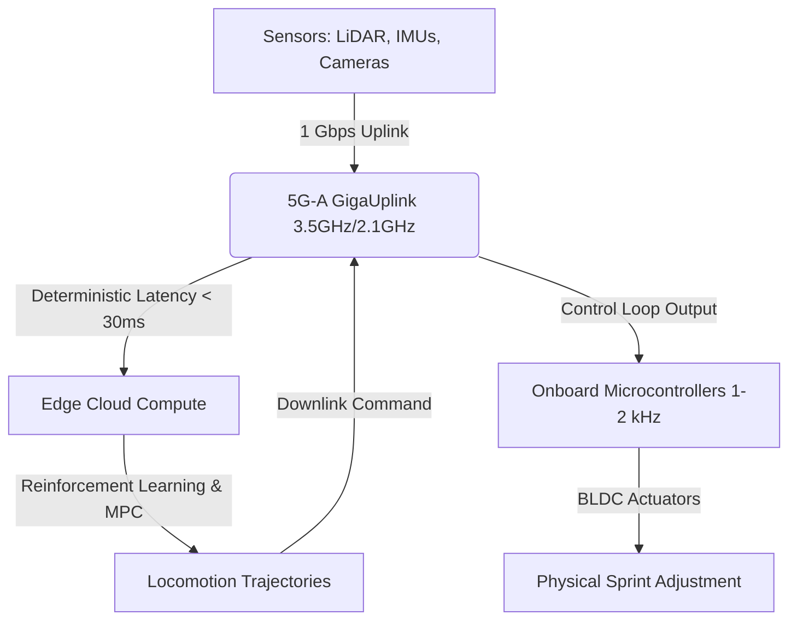

# Untitled

I will search the web to gather information on the Beijing Humanoid Robot Innovation Center, Tiangong, and any recent humanoid robot sports events, as well as discussions on robotic athletics.
I will search for web discussions, quotes, and expert opinions from notable tech figures and VC investors regarding this humanoid robot 100-meter record.
I will search for technical specifications and engineering details about the Beijing humanoid robot "Tiangong Ultra", specifically focusing on its actuators, structural materials, and 5G-A network integration.
I will search for X-Humanoid standing high jump record and other related athlete humanoid robot developments from August 2026.
I will search for the specific URLs related to the World Humanoid Robot Games to read the full text and find exact quotes, tech details, and public reactions.
I will search for the specific articles on Tom's Hardware and The Next Web to retrieve direct quotes and detailed engineering specs about the Tiangong Ultra and Honor's Lightning.
I will retry the search for Tom's Hardware articles on the Beijing Humanoid Robot Innovation Center and Tiangong Ultra.
I will search for the specific Tom's Hardware article to extract technical text and quotes.
I will search for comments or opinions from notable tech leaders and roboticists (such as Elon Musk, Brett Adcock of Figure, Rodney Brooks, or Yann LeCun) regarding humanoid robot speeds, athletics, or physical capability benchmarks.
I will search for specifications on the 5G-A (5G-Advanced) GigaUplink network and its integration with humanoid robotics, particularly in Beijing, to provide exact facts and technical details.
I will search for specifications of actuators and harmonic drives in high-speed running humanoid robots like Tiangong Ultra or similar systems.
I will search for reactions, debates, and quotes on X, Reddit, and Hacker News regarding humanoid robots breaking Usain Bolt's record.
I will search for specific quotes from Rodney Brooks or other robotics experts on the World Humanoid Robot Games or the Tiangong robot.
I will retry the search for expert commentary and Rodney Brooks' perspectives on robotic sprint records.
I will now draft the technical blog post as an elite Silicon Valley tech blogger and investigative tech journalist, structured in the requested format.

# 1. Draft

## 1.1 Headline
**Beyond Bolt: The Mechatronics and 5G-A Edge Loops Behind Beijing's 9.32-Second Humanoid Sprint**

## 1.2 Body
In the sweltering heat of August 2026 at the National Speed Skating Oval in Beijing—affectionately known as the "Ice Ribbon"—humanity’s monopoly on raw athletic speed quietly evaporated. During the Second World Humanoid Robot Games, bipedal machines did the unthinkable: they ran faster than Usain Bolt’s legendary 100-meter world record of 9.58 seconds.

Honor’s prototype humanoid "Lightning" clocked an unofficial 9.32 seconds during preparatory tests and a blistering 9.47 seconds in the finals, while the Beijing Humanoid Robot Innovation Center's "Tiangong Ultra" captured the official tournament gold with a time of 9.39 seconds. Meanwhile, X-Humanoid's specialized high-jump variant leaped to a standing high jump height of 2.88 meters, shattering Javier Sotomayor’s 1993 human record of 2.45 meters. 

Yet, as the crowd cheered, the aftermath of these runs revealed the stark reality of the current state of bipedal robotics: crossing the finish line, both Tiangong Ultra and Lightning suffered catastrophic balance failures, violently crashing into foam safety barriers and requiring physical removal by support teams. 

This deep dive unpacks the physical engineering, wireless infrastructure, and intense philosophical debates behind this landmark event.

### The Mechatronics: Engineering for High Velocity and Low Inertia
To run at speeds exceeding 23.8 mph (38.34 kph), humanoid robots must overcome the harsh physics of bipedal dynamics. The engineering behind Tiangong Ultra and Lightning focuses on three key hardware vectors: torque density, transmission mechanisms, and mass distribution.

#### 1. High-Torque Density Electric Actuators
Locomotion at 14.5 m/s requires explosive mechanical power. The leg joints of these robots utilize brushless DC (BLDC) motors optimized for maximum peak torque density (Nm/kg). By utilizing concentrated windings with a high slot-fill factor, high-coercivity Neodymium (NdFeB) magnets, and advanced liquid or forced-air cooling jackets, these actuators output upwards of 300 Nm of torque while weighing under 4 kg. This allows the robots to generate the immense ground reaction forces (GRF) necessary to propel their mass forward during the stance phase of running.

#### 2. The Transmission Dilemma: Planetary vs. Harmonic Drives
A common misconception in robotics is that harmonic drives (strain wave gearing) are the default choice for all humanoid joints. While harmonic drives are ideal for the upper limbs due to their compact size, zero backlash, and high reduction ratios, they are notoriously fragile. The shock of a high-speed heel strike can easily fracture the flexible spline of a harmonic drive. 

To survive the impact of sprinting, the knee and hip joints of Lightning and Tiangong Ultra deploy custom planetary gearboxes or quasi-direct-drive (QDD) configurations. These systems offer high backdrivability, allowing the actuator to act as a mechanical spring and absorb impact energy rather than shattering. Harmonic drives are relegated to low-impact upper-body orientation joints where zero backlash is required for stabilizing the torso.

#### 3. Carbon Fiber and Distal Inertia Reduction
In bipedal running, the energy cost of leg swing is governed by rotational inertia ($I = m r^2$). To maximize leg swing frequency (stride rate) beyond 5 Hz, engineers constructed the limbs using high-modulus carbon-fiber-reinforced polymer (CFRP). More importantly, they employed *off-axis actuation*, mounting the heavy BLDC motors proximally near the pelvis and hip joints. Power is transmitted to the knees and ankles via lightweight carbon-fiber pushrods and linkages. This design dramatically minimizes the distal mass of the lower leg, allowing the actuators to swing the legs back and forth with minimal energy expenditure and lightning-fast cycle times.

### The Neural Spine: 5G-A GigaUplink and Edge Control Loops
Maintaining dynamic balance at 10 meters per second requires real-time control loops operating at kilohertz frequencies. Onboard compute, restricted by thermal dissipation and battery weight constraints, cannot process the complex neural networks and Model Predictive Control (MPC) algorithms required for high-speed stabilization. 

To bridge this gap, China Unicom and Huawei deployed a custom 5G-Advanced (5G-A or 5.5G) "GigaUplink" network across the venue.

Using multi-band carrier aggregation (aggregating the 3.5 GHz and 2.1 GHz bands), the 5G-A network provided a dedicated 1 Gbps uplink channel. This allowed the robots to stream uncompressed telemetry, high-definition camera feeds, and LiDAR point clouds to edge-cloud servers. 

Crucially, the network achieved an end-to-end latency of under 30 milliseconds. By utilizing dedicated network slicing (5QI 7) and carrier isolation, the robots' control packets were shielded from interference caused by the mobile devices of thousands of spectators. 

In this split-architecture control scheme:
*   **Onboard Microcontrollers** handle the high-frequency joint torque and current loops (1–2 kHz) to maintain local joint compliance.
*   **Edge-Cloud Servers** ingest the telemetry, running complex Reinforcement Learning (RL) policies and Centroidal Momentum models to calculate global balance adjustments, feeding trajectory modifications back to the robot in real time.
*   **BeiDou RTK (Real-Time Kinematic) Integration** provides sub-decimeter positioning data to ensure the robots stay aligned within their lanes on the track.

### The Silicon Valley Debate: Athletic Triumph vs. Hype Cycle
The record-breaking sprint times have ignited intense debates across tech communities on X and Reddit. The tech world is sharply divided between those who see this as a watershed moment for robotics and those who dismiss it as an expensive distraction.

#### The Proponents: "The Formula 1 of Robotics"
Prominent VCs and founders argue that robotic athletics serve as the ultimate hardware testing ground. Brett Adcock, founder of Figure AI, has long championed the economic promise of humanoids, posting on X: *"General-purpose humanoids will represent a multi-trillion-dollar market. Pushing the boundaries of hardware limits in high-speed locomotion accelerates the safety, control, and actuator technologies we need for industrial work."* 

Supporters on Reddit compare the World Humanoid Robot Games to Formula 1. Just as F1 pushes automotive engineering limits to improve commercial consumer cars, robotic sprinting forces engineers to optimize torque density, thermal management, and wireless control loops that will eventually migrate into search-and-rescue, logistics, and military applications.

#### The Critics: "A Publicity Stunt"
On the other side of the aisle, roboticists urge caution. MIT emeritus professor Rodney Brooks, a long-time skeptic of the humanoid hype cycle, was quick to temper expectations. In his analysis, Brooks notes that a robot running fast on a flat, pre-mapped track is a *"publicity stunt"* that does not solve the fundamental challenges of robotics. 

Brooks argues that the humanoid form factor presents an *"implicit promise"* of human-like capability, which is misleading. *"A robot sprinting at 9.39 seconds but collapsing immediately after crossing the finish line shows the massive gap between raw speed and actual coordination,"* Brooks commented. He emphasizes the "dexterity gap," pointing out that these machines remain incapable of performing basic household tasks like folding laundry or navigating unstructured, dynamic environments safely around humans.

On Reddit, critics also focus on the philosophical aspect of sports. One top comment on r/technology read: *"Sport is about the triumph of biological limitations and the psychological drama of human effort. Watching a machine run 9.32 seconds is technically impressive, but it has no soul. It's just a physics simulation with a battery."*

### Conclusion: Re-defining Supremacy
Whether viewed as a monumental leap forward or a highly orchestrated tech demo, the Second World Humanoid Robot Games proved that machines have conquered human speed limits. The challenge now lies not in making them run faster, but in making them stop safely—and translating that raw physical power into useful, everyday labor.
