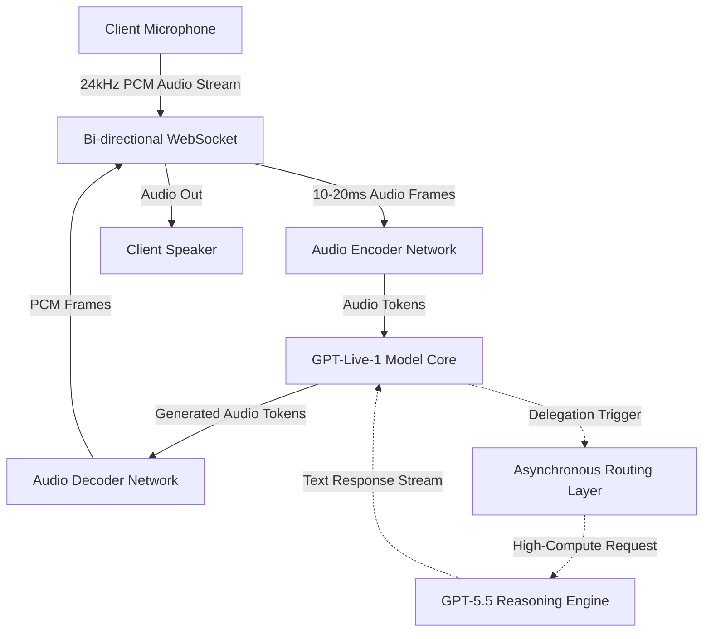

# **Voice-Native at Scale: How OpenAI’s GPT-Live Full-Duplex Architecture Pushes WebSockets and GPU Clusters to the Limit**

####

The launch of OpenAI's **GPT-Live** on July 8, 2026, marks a watershed moment in human-computer interaction, finalizing the death of the turn-based "walkie-talkie" voice assistant. For years, interacting with AI voices felt like communicating over a high-latency radio link. The sequential pipeline of ASR (Automatic Speech Recognition) $\rightarrow$ LLM inference $\rightarrow$ TTS (Text-to-Speech) introduced a latency bottleneck of 1.5 to 3 seconds. Worse, it was structurally incapable of handling interruptions; if you spoke over it, the system would continue rambling until its audio buffer cleared.

GPT-Live-1 and GPT-Live-1 mini replace this legacy cascade with a native, bi-directional speech-to-speech architecture. The system ingests raw audio (24kHz, 16-bit mono PCM encoded in G.711 or Opus) over persistent, bi-directional **WebSocket** connections. This stream is sliced into 10–20ms frames and fed directly into an audio encoder network. The model processes the audio tokens natively, projecting them into a continuous latent space, and generates corresponding audio tokens that stream back to the user with sub-200ms latency.

To make this fluid, OpenAI had to solve two major technical hurdles: **Semantic Voice Activity Detection (VAD)** and **Asynchronous Background Delegation**.



Traditional VAD libraries rely on simple signal-to-noise ratio thresholds to detect silence. In a live conversation, this causes the AI to cut out during minor pauses or ignore natural backchanneling (like "mhmm" or "yeah"). GPT-Live resolves this with server-side **Semantic VAD** integrated directly into the audio encoder. The model constantly evaluates the linguistic intent of the incoming stream. If the user mutters a backchannel, the AI continues speaking. If the user initiates a true interruption ("Wait, stop there"), the server immediately triggers a cancellation event (`response.cancel`).

When an interruption occurs, the server must handle the **KV Cache Truncation Problem**. Because the transformer generates tokens ahead of what the client has actually played, the server must sync the model's inner memory with the user's auditory experience. The client reports the exact millisecond offset of the stopped audio, and the server executes a `conversation.item.truncate` event. This slices the KV Cache at the exact token corresponding to the interruption, discarding the forward-generated tokens. Without this rollback, the model's memory of the conversation would desynchronize from what the user heard, leading to context drift.

However, maintaining a sub-200ms audio loop requires a smaller, speed-optimized model. GPT-Live-1 cannot perform complex mathematical reasoning or deep web searches in real-time. To bypass this, OpenAI implemented an agentic **cascade delegation protocol**. When a query requires high compute, GPT-Live-1 routes the request to a background reasoning engine, **GPT-5.5** (released in April 2026). 

```
[User] "What is the derivative of x^2 * sin(x) at x=pi?"
   |
   v
[GPT-Live-1] (Latency: ~150ms)
   |-- Realizes mathematical reasoning is required.
   |-- Spawns Background Thread to GPT-5.5.
   |-- Generates Conversational Filler: "Let's work that out..."
   |
   v
[GPT-5.5 Reasoning Engine] (Latency: ~3.2s)
   |-- Executes chain-of-thought tokens.
   |-- Solves: 2x*sin(x) + x^2*cos(x) at pi -> -pi^2.
   |-- Streams text solution to GPT-Live-1.
   |
   v
[GPT-Live-1] 
   |-- Receives answer: "-pi^2".
   |-- Text-to-Speech stream: "Using the product rule, the derivative is... which evaluates to negative pi squared, or roughly -9.87."
```

To mask the 3-to-5 second latency of the background model, GPT-Live-1 generates "conversational padding" or verbal fillers ("Let me look that up for you..." or a thoughtful "Hmm..."). Once GPT-5.5 finishes reasoning, the text output is streamed to GPT-Live-1's speech generation queue. This keeps the client session memory footprint low, discarding GPT-5.5's massive chain-of-thought KV cache after the final output is integrated.

Despite this architectural triumph, the release has faced severe economic and social friction. Plus ($20/month) and Pro ($200/month) subscribers have encountered strict, dynamic usage limits, often capping conversations to roughly 30 to 60 minutes of active use per day. The cause is the brutal unit economics of full-duplex inference. Text-based LLMs only consume GPU cycles during request-response bursts. A full-duplex voice stream, however, requires continuous GPU allocation to process incoming audio frames, execute Semantic VAD, and maintain the open WebSocket connection. 

As one prominent AI researcher noted on Hacker News: 
> "The unit economics of always-on voice are terrifying. You are reserving dedicated H100/B200 capacity for a single user to essentially listen to silence 70% of the time. Standard subscriptions simply cannot sustain unlimited full-duplex voice."

Furthermore, the "always-listening" nature of active sessions has triggered a privacy backlash. To handle interruptions in real-time, the microphone stream must continuously send data to OpenAI's servers. While OpenAI's data policies allow opting out of model training and ensure a 30-day purge cycle for deleted chats, corporate security teams are already blocking the feature to prevent ambient recording of sensitive workplace conversations. 

GPT-Live-1 has successfully solved the voice latency barrier, but until inference costs drop by another order of magnitude, full-duplex voice will remain a metered, premium luxury rather than a primary computing interface.

***

### 4. Highlight

#### 4.1 Key Questions
1. How does GPT-Live process simultaneous voice input and output without the traditional "walkie-talkie" lag?
2. What are the compute and unit economics limitations that cause severe usage limits on paid accounts?
3. How does the server-side Semantic VAD handle interruptions and synchronize the model's KV Cache?

#### 4.2 Highlight Text
OpenAI's launch of GPT-Live-1 marks the death of turn-based voice AI, ushering in a voice-native, full-duplex era. By streaming 24kHz audio frames over persistent WebSockets, GPT-Live achieves sub-200ms speech-to-speech response times. Using server-side Semantic VAD, the model distinguishes between casual backchannels and true interruptions, rolling back the transformer's KV Cache on the fly. For heavy reasoning, the system delegates to GPT-5.5 in the background, masking latency with natural conversational fillers. However, continuous GPU saturation makes the unit economics brutal, forcing strict usage caps and raising security concerns for enterprise environments.

#### 4.3 Hashtags
#GPTLive #OpenAI #AIArchitecture #FullDuplex #LLM #GPT5
